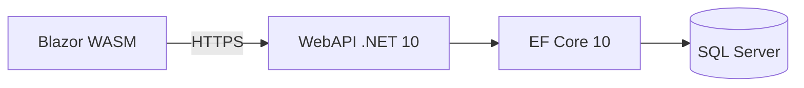

# Design — CorePay

Documento de arquitetura e contratos de API/frontend.

## Visão geral

O CorePay opera com **desacoplamento total** entre backend e frontend. A comunicação ocorre exclusivamente via API REST versionada (`/api/v1/...`).



## Stack

| Camada | Tecnologia |
|--------|------------|
| Backend | .NET 10 minimal APIs, CQRS (MediatR), Result Pattern |
| Frontend | Blazor WebAssembly (.NET 10) |
| Banco | SQL Server (Docker local) |
| Versionamento | Asp.Versioning.Http |
| Identificadores | Sempre `Guid` / UUID (`uniqueidentifier`). Sem `int` IDENTITY sequencial. Ver `agents.md` §3.1. |

## Estrutura de pastas

```text
backend/src/
├── BuildingBlocks/
├── Core/
│   ├── Auth/
│   ├── Domain/
│   └── Application/
│       └── Common/
├── Infrastructure/
│   ├── Identity/
│   └── Seed/
└── WebAPI/
    ├── Auth/
    └── Endpoints/

frontend/src/WebApp.Blazor/
├── Components/
│   ├── Layout/
│   ├── Ui/
│   └── Payroll/
├── Layout/
├── Pages/
└── Services/
```

## Endpoints implementados (health, auth, admin, cadastros mestres 3.1)

### POST /api/v1/auth/login

Autenticação por e-mail e senha. Acesso anônimo.

**Request:**

```json
{
  "email": "superadmin@corepay.test",
  "password": "ChangeMe-SuperAdmin-Password-123!"
}
```

**Response 200:**

```json
{
  "accessToken": "eyJhbGciOiJIUzI1NiIsInR5cCI6IkpXVCJ9...",
  "expiresAtUtc": "2026-09-09T19:00:00.0000000Z",
  "user": {
    "id": "uuid",
    "email": "superadmin@corepay.test",
    "displayName": "Super Admin",
    "roles": ["SuperAdmin"],
    "permissions": ["departments.read", "departments.write"]
  }
}
```

| Campo | Tipo | Descrição |
|-------|------|-----------|
| `accessToken` | string | JWT Bearer |
| `expiresAtUtc` | datetime (UTC) | Expiração do token |
| `user.id` | uuid (string) | Id do Identity (`sub`) — GUID, nunca sequencial |
| `user.email` | string | E-mail (= `UserName`) |
| `user.displayName` | string | Nome de exibição |
| `user.roles` | string[] | Papéis do usuário |
| `user.permissions` | string[] | Permission keys efetivas (SuperAdmin = todas) |

**Response 401:** credenciais inválidas (mensagem genérica, sem revelar qual campo falhou).

**Claims JWT:** `sub`, e-mail, nome, `ClaimTypes.Role`, claim `permission` por permissão.

## Auth frontend (Fase 2.2)

Autenticação Blazor WASM via JWT stateless. Sem refresh token, sem cookies, sem self-signup.

### Fluxo

1. App inicia → `AuthService.InitializeAsync()` restaura sessão de `localStorage` (se válida e não expirada).
2. Usuário anônimo em rota `[Authorize]` → redirect para `/login?returnUrl=...`.
3. Login → `POST /api/v1/auth/login` → persiste sessão → `NotifyAuthenticationStateChanged` → redirect para `returnUrl` ou `/`.
4. Requests autenticados → `AuthorizationMessageHandler` injeta `Authorization: Bearer {accessToken}`.
5. Logout → limpa `localStorage` + estado → redirect `/login`.

### Persistência de sessão

| Chave | Valor |
|-------|-------|
| `localStorage` key | `corepay.auth.session` |
| Formato | JSON camelCase de `AuthSession` (`accessToken`, `expiresAtUtc`, `user`) |
| Expiração | Cliente rejeita sessão quando `DateTime.UtcNow >= expiresAtUtc` |
| Bridge JS | `wwwroot/js/auth.js` (`corepayAuth.getSession/setSession/clearSession`) |

### Autorização Blazor

- `AuthorizeRouteView` + `CascadingAuthenticationState` em `App.razor`.
- Policies dinâmicas `permission:{key}` via `PermissionPolicyProvider` + `PermissionAuthorizationHandler`.
- Policies any-of `permission-any:{key1,key2,...}` via `AnyPermissionRequirement` + `AnyPermissionAuthorizationHandler` (Configurações).
- Constantes de policy em `Auth/AppPolicies.cs` (uso em `[Authorize(Policy = ...)]` e `ShellNavigation`).
- SuperAdmin bypassa qualquer policy (espelha backend).
- Estado `Authorizing`: `Spinner` + texto “Carregando...”.
- Não autenticado → `RedirectToLogin`; autenticado sem policy → `AccessDenied`.

### Serviços frontend

| Serviço | Arquivo | Responsabilidade |
|---------|---------|------------------|
| `AuthService` | `Services/AuthService.cs` | Login, logout, init, sessão atual |
| `CorePayAuthenticationStateProvider` | `Services/CorePayAuthenticationStateProvider.cs` | Claims a partir da sessão |
| `AuthorizationMessageHandler` | `Services/AuthorizationMessageHandler.cs` | Header Bearer |
| `JsAuthSessionStorage` | `Auth/JsAuthSessionStorage.cs` | Persistência localStorage |

## Shell autenticado (Fase 2.3)

Layout fullscreen para rotas autenticadas: sidebar 256px + topbar blur + main com padding 24px. Login e telas anônimas usam `EmptyLayout` sem shell.

### Composição

| Componente | Arquivo | Responsabilidade |
|------------|---------|------------------|
| `MainLayout` | `Layout/MainLayout.razor` | Orquestra shell quando `AuthService.IsAuthenticated`; overlay mobile |
| `AppSidebar` | `Components/Layout/AppSidebar.razor` | Logo, nav filtrada por permissão, rodapé usuário + logout |
| `AppHeader` | `Components/Layout/AppHeader.razor` | Trigger sidebar, título da rota (desktop), tema, notificações |
| `SidebarTrigger` | `Components/Layout/SidebarTrigger.razor` | Collapse desktop (`PanelLeftClose`/`Open`) ou drawer mobile |
| `SidebarState` | `Services/SidebarState.cs` | Estado efêmero: `IsDesktopCollapsed`, `IsMobileOpen` |
| `ShellNavigation` | `Layout/ShellNavigation.cs` | Itens de menu com policy por rota + resolução de título por path |
| `AppPolicies` | `Auth/AppPolicies.cs` | Nomes de policy para rotas e menu |

### Comportamento responsivo

| Breakpoint | Sidebar | Trigger |
|------------|---------|---------|
| `< 1024px` | Drawer off-canvas; overlay `black/60` (z-30); abre/fecha via trigger mobile | Hamburger (`PanelLeftOpen`); overlay e navegação fecham o drawer |
| `≥ 1024px` | Estática 256px; collapse para width 0 | `PanelLeftClose`/`Open`; título da rota visível na topbar |

Transições: nav 150ms; sidebar 300ms. Respeita `prefers-reduced-motion`.

### Nav ativa

- `NavLink` com `ActiveClass="app-sidebar__nav-link--active"`.
- Dashboard (`/`) usa `NavLinkMatch.All`; demais rotas `Prefix`.
- Item ativo: fundo `primary`, texto branco, sombra primary 20%, chevron 12px (`IconKind.ChevronRight`).

## Menu por permissão (Fase 2.4)

Sidebar e rotas respeitam RBAC. SuperAdmin bypassa checks (role + todas as permission keys na sessão).

### Policies

| Prefixo | Exemplo | Uso |
|---------|---------|-----|
| `permission:` | `permission:payrolls.read` | Permissão única |
| `permission-any:` | `permission-any:departments.write,careerlevels.write,projects.write,paymentmethods.write` | Qualquer uma das keys (Configurações) |

### Mapa rota → policy

| Rota | Policy |
|------|--------|
| `/` | autenticado |
| `/payrolls` | `permission:payrolls.read` |
| `/payrolls/new` | `permission:payrolls.write` |
| `/payrolls/{id:guid}` | `permission:payrolls.read` |
| `/payrolls/{id:guid}/edit` | `permission:payrolls.write` |
| `/collaborators` | `permission:collaborators.read` |
| `/analyst-metrics` | `permission:analystmetrics.read` |
| `/project-revenues` | `permission:revenues.read` |
| `/traffic-investment` | `permission:traffic.read` |
| `/financial` | `permission:finance.read` |
| `/cashflow` | `permission:cashflow.read` |
| `/reports` | `permission:reports.read` |
| `/settings` | `permission-any:departments.write,careerlevels.write,projects.write,paymentmethods.write` |
| `/admin/users` | `permission:users.read` |
| `/admin/roles` | `permission:roles.read` |
| `/notifications` | autenticado |

`AppSidebar` oculta itens sem policy satisfeita; seção **Administração** só aparece se houver ao menos um item admin visível. URL direta sem permissão → `AccessDenied` (autenticado) via `AuthorizeRouteView`.

### Escopo das subfases 2.3–2.4

- **2.3:** shell visual, páginas stub, nav ativa.
- **2.4:** filtragem de menu + `[Authorize(Policy = ...)]` por rota; Manager sem financeiro/relatórios/caixa/tráfego; **com** faturamento (`revenues.read`/`revenues.write`).

## Rotas da folha (Fase 2.5)

Quatro rotas Blazor com RBAC, constraint `{id:guid}` e guarda de recurso compartilhada. API de lista/detalhe/duplicação (7.2), casca nova/editar (7.3), editor por perfil com preview (7.4) e salvar/submeter (7.5) implementados.

### Mapa rota → policy

| Rota | Policy | Página |
|------|--------|--------|
| `/payrolls` | `permission:payrolls.read` | `Pages/Payrolls.razor` |
| `/payrolls/new` | `permission:payrolls.write` | `Pages/Payroll/NewPayroll.razor` |
| `/payrolls/{id:guid}` | `permission:payrolls.read` | `Pages/Payroll/PayrollDetail.razor` |
| `/payrolls/{id:guid}/edit` | `permission:payrolls.write` | `Pages/Payroll/PayrollEdit.razor` |

GUID inválido na URL não casa com `{id:guid}` → `Router` renderiza `NotFound` (`/not-found`, `MainLayout`, pt-BR).

### Guarda de recurso (`PayrollResourceGuard`)

Detalhe e edição chamam `PayrollApiService.GetPayrollAsync(id)`:

| Status HTTP | UI |
|-------------|-----|
| 200 | Renderiza `ChildContent` com `PayrollDetailDto` |
| 404 | `EmptyState` — título “Folha não encontrada” |
| 403 | `AccessDenied` (recurso existe fora do escopo do Manager — **não** mascarar como 404) |
| Outros / rede | `EmptyState` genérico de erro |

Loading: `Spinner` + “Carregando...” (mesmo padrão da auth).

### GET /api/v1/payrolls (Fase 7.2)

Auth: `payrolls.read`.

**Query params:** `search`, `month`, `year`, `status` (`draft` \| `pendingApproval` \| …), `departmentId`.

Manager: lista filtrada por `UserDepartments`; `departmentId` fora do escopo → **403** `payrolls.department_forbidden`. Ordenação: `year DESC`, `month DESC`, `departmentName ASC`. Busca: nome do setor ou colaborador nas entradas.

**Response 200:** array de `PayrollListItemResponse`:

```json
{
  "id": "3fa85f64-5717-4562-b3fc-2c963f66afa6",
  "departmentId": "11111111-1111-1111-1111-111111111111",
  "departmentName": "Analistas Comerciais",
  "month": 1,
  "year": 2026,
  "status": "paid",
  "totalAmount": 125000.00,
  "entryCount": 12,
  "submittedBy": "manager@test"
}
```

### GET /api/v1/payrolls/form-options (Fase 7.3)

Auth: `payrolls.read`.

**Response 200:**

```json
{
  "departments": [
    { "id": "11111111-1111-1111-1111-111111111111", "name": "Analistas Comerciais" }
  ]
}
```

Manager: apenas setores em `UserDepartments`. Admin/Financial: todos.

### GET /api/v1/payrolls/{id} (Fase 7.2 + 7.3 + 7.4 + 7.6 + 8.1)

Auth: `payrolls.read`. `{id}` = GUID.

**Response 200:** `PayrollDetailResponse` — cabeçalho + `entries[]` (editor completo por colaborador, enriquecido para detalhe) + `editorOptions` (projetos, setores, níveis para selects) + `allowedActions` (Fase 8.1).

**Capacidades (`allowedActions`, Fase 8.1):** calculadas em `PayrollCapabilitiesEvaluator` a partir das claims JWT `permission` + `PayrollStatus` atual. SuperAdmin bypassa permissões. Mutations na Fase 8.2 respeitam a mesma matriz.

| Campo | Permissão | Condição de status |
|---|---|---|
| `approvePayroll` / `rejectPayroll` | `payrolls.approve` | `pendingApproval` |
| `approveEntry` | `payrolls.approve` | — |
| `edit` / `recalculate` | `payrolls.write` | `draft` \| `rejected` |
| `payPayroll` / `payEntry` / `toggleNf` | `payrolls.pay` | **não** `pendingApproval` |
| `postApprovalAdjustments` | `payrolls.pay` | `approved` |
| `delete` | `payrolls.delete` | — |

Cada entry inclui `isPaid`, `nfSent`, `result` (`PayrollEntryResultResponse`) e `projectTotals` (`PayrollProjectTotalResponse[]`) para a tela de detalhe.

**Snapshot calculado (7.6):** `Payload.CalculatedResult` + `Payload.DisplayProjectTotals` persistidos no save/submit (`PUT`/`POST submit`). Estados travados (`pendingApproval`, `approved`, `paid`) **não recalculam** no GET — leem o snapshot. `draft`/`rejected` usam snapshot persistido se existir; senão calculam em memória (sem gravar no GET).

```json
{
  "id": "3fa85f64-5717-4562-b3fc-2c963f66afa6",
  "departmentId": "11111111-1111-1111-1111-111111111111",
  "departmentName": "Analistas Comerciais",
  "month": 3,
  "year": 2026,
  "status": "draft",
  "totalAmount": 0,
  "entryCount": 1,
  "submittedBy": null,
  "rejectionComment": null,
  "approvedBy": null,
  "approvedAt": null,
  "entries": [
    {
      "id": "22222222-2222-2222-2222-222222222222",
      "collaboratorId": "33333333-3333-3333-3333-333333333333",
      "collaboratorName": "Ana Comercial",
      "careerLevelName": "Analista Comercial Júnior",
      "pixKey": "11999990001",
      "admissionDate": "2024-03-01",
      "fullBaseSalary": 3500,
      "calculationProfile": "commercialAnalyst",
      "isApproved": false,
      "isPaid": false,
      "nfSent": false,
      "goalTier": "none",
      "finalSalary": null,
      "betanoInternaCount": 0,
      "betanoMundoBetCount": 0,
      "supervisorAnalystRevenue": 0,
      "commissionPayingProjectId": null,
      "payload": {
        "projectEntries": [],
        "commercialProjectEntries": [],
        "bonusEntries": [],
        "deductionEntries": [],
        "roleChanges": []
      },
      "result": {
        "totalAmount": 4300,
        "baseSalary": 870,
        "commissionAmount": 3430,
        "goalBonusAmount": 0,
        "groupCommissionAmount": 0,
        "platformTotal": 400
      },
      "projectTotals": [{ "projectId": "...", "amount": 3900 }]
    }
  ],
  "editorOptions": {
    "projects": [{ "id": "...", "name": "Projeto Hubla Demo", "platform": "hubla" }],
    "departments": [{ "id": "...", "name": "Analistas Comerciais" }],
    "careerLevels": [{ "id": "...", "name": "Analista Júnior", "profile": "commercialAnalyst" }]
  },
  "allowedActions": {
    "approvePayroll": false,
    "rejectPayroll": false,
    "approveEntry": false,
    "edit": true,
    "payPayroll": false,
    "payEntry": false,
    "toggleNf": false,
    "postApprovalAdjustments": false,
    "delete": false,
    "recalculate": true
  }
}
```

Folha `rejected` + Manager: `entries` **omite** linhas com `isApproved: true` (persistem no banco). `entryCount` reflete o total real.

**UI detalhe (8.1 + 8.2):** `PayrollDetailSection` + `PayrollDetailWorkflowBar` + `PayrollDetailEntryActions`. Botões visíveis quando `allowedActions` **e** policy local (`payrolls.approve` / `pay` / `write` / `delete`) coincidem. Mutações chamam a API e atualizam o modelo local com a resposta 200; dialog obrigatório para reprovação (comentário) e confirmação de exclusão. “Editar” usa `allowedActions.edit` + `payrolls.write`.

**Response 404:** `payrolls.not_found`.

**Response 403:** `payrolls.department_forbidden` — folha existe fora do escopo do Manager.

### POST /api/v1/payrolls (Fase 7.3)

Auth: `payrolls.write`.

**Request:**

```json
{
  "departmentId": "11111111-1111-1111-1111-111111111111",
  "month": 3,
  "year": 2026,
  "collaboratorIds": ["33333333-3333-3333-3333-333333333333"]
}
```

Cria folha `draft`, `totalAmount: 0`. Colaboradores devem ser **ativos** e do setor informado; **`collaboratorIds` não pode ser vazio** (`400 payrolls.entries_required`). Snapshot via `PayrollEntrySnapshotBuilder`.

**Response 201** + `Location: /api/v1/payrolls/{id}` + corpo `PayrollDetailResponse`.

**Response 409:** `payrolls.competence_duplicate`.

**Response 422/400:** `payrolls.entries_required`, `payrolls.collaborator_not_in_department`, `payrolls.collaborator_inactive`, `payrolls.collaborator_already_in_payroll`, `payrolls.collaborator_not_found`.

**Response 403:** `payrolls.department_forbidden`.

### PUT /api/v1/payrolls/{id} (Fase 7.3 + 7.5)

Auth: `payrolls.write`. Somente status `draft` ou `rejected` (`409 payrolls.status_not_editable`).

**Request:**

```json
{
  "collaboratorIds": ["33333333-3333-3333-3333-333333333333"],
  "entries": [
    {
      "entryId": "22222222-2222-2222-2222-222222222222",
      "goalTier": "none",
      "commercialProjectEntries": [],
      "bonusEntries": [],
      "deductionEntries": []
    }
  ]
}
```

- `collaboratorIds` — sincroniza colaboradores editáveis; cabeçalho (setor/mês/ano) **imutável**; não pode ficar vazio (`400 payrolls.entries_required`).
- `entries` (opcional) — campos editáveis por linha (`UpdatePayrollEntryRequest`, mesmo shape de `PreviewPayrollEntryRequest` + `entryId`). Quando omitido, apenas sincroniza colaboradores.
- Transação atômica: aplica entradas visíveis → `RecalcAllEntries` → persiste payload + `totalAmount` da folha. Falha de cálculo → **400** sem gravar alterações.

Manager + `rejected`: entradas `isApproved: true` preservadas mesmo ausentes do body; não podem ser alteradas (`403 payrolls.approved_entry_readonly`).

**Response 200:** `PayrollDetailResponse` com `totalAmount` atualizado.

**Response 400:** erros do motor (`traffic.manual_rateio_not_allowed`, etc.).

### POST /api/v1/payrolls/{id}/submit (Fase 7.5)

Auth: `payrolls.write`. Somente status `draft` ou `rejected`. Body vazio.

Recalcula totais a partir dos valores persistidos, depois transiciona para `pendingApproval`, grava `submittedBy` = display name do JWT (`ClaimTypes.Name`) e `submittedByUserId` = `sub` do JWT. Emite 2 notificações `payroll_submitted` (`role_target`: Director + Admin) na mesma transação (Fase 14.1).

**Response 200:** `PayrollDetailResponse` com `status: "pendingApproval"`.

**Response 400:** `payrolls.entries_required` se a folha não tiver colaboradores.

**Response 409:** `payrolls.status_not_editable`.

### POST /api/v1/payrolls/{id}/duplicate (Fase 7.2)

Auth: `payrolls.write`. Sem body — destino = **mês seguinte** do mesmo setor (dez/2025 → jan/2026).

Copia entradas + payload + `totalAmount`; nova folha `draft`; zera `isApproved`/`isPaid`/`nfSent` e campos de workflow do cabeçalho; novos GUIDs. Origem **sem entradas** → `400 payrolls.entries_required`.

**Response 201** + `Location: /api/v1/payrolls/{newId}`.

**Response 409:** `payrolls.competence_duplicate` se competência destino já existir.

**Response 403/404:** escopo ou folha inexistente.

### POST /api/v1/payrolls/{id}/approve (Fase 8.2)

Auth: `payrolls.approve`. Somente status `pendingApproval`.

Recalcula e persiste snapshot + `totalAmount`; transiciona para `approved`; grava `approvedBy`/`approvedAt`; limpa `rejectionComment`; marca todas as entradas `isApproved: true`. Emite notificação `payroll_approved` para `submittedByUserId` (Fase 14.1).

**Response 200:** `PayrollDetailResponse` atualizado.

**Response 400:** `payrolls.entries_required` se a folha não tiver colaboradores.

**Response 409:** `payrolls.status_not_approvable`.

### POST /api/v1/payrolls/{id}/reject (Fase 8.2)

Auth: `payrolls.approve`. Somente status `pendingApproval`.

**Request:** `{ "rejectionComment": "..." }` — obrigatório não vazio.

**Response 400:** `payrolls.rejection_comment_required`.

**Response 409:** `payrolls.status_not_rejectable`.

Em sucesso, emite notificação `payroll_rejected` para `submittedByUserId` com comentário na mensagem (Fase 14.1).

### POST /api/v1/payrolls/{id}/recalculate (Fase 8.2)

Auth: `payrolls.write`. Somente `draft`/`rejected`. Recalcula e persiste snapshot + total.

**Response 409:** `payrolls.status_not_editable`.

### POST /api/v1/payrolls/{id}/pay (Fase 8.2)

Auth: `payrolls.pay`. Status **≠** `pendingApproval`. Marca todas as entradas `isPaid: true`; todos pagos → status `paid`.

**Response 400:** `payrolls.no_entries`.

**Response 409:** `payrolls.pending_approval_cannot_pay`.

### DELETE /api/v1/payrolls/{id} (Fase 8.2)

Auth: `payrolls.delete`. Exclusão física. **Response 204**.

### POST /api/v1/payrolls/{id}/entries/{entryId}/approve (Fase 8.2)

Auth: `payrolls.approve`. Marca `isApproved: true`.

### POST /api/v1/payrolls/{id}/entries/{entryId}/pay (Fase 8.2)

Auth: `payrolls.pay`. **Request:** `{ "isPaid": true|false }`. Sincroniza status folha (`paid` ↔ `approved`).

### PUT /api/v1/payrolls/{id}/entries/{entryId}/nf (Fase 8.2)

Auth: `payrolls.pay`. **Request:** `{ "nfSent": true|false }`.

### PUT /api/v1/payrolls/{id}/entries/{entryId} (Fase 8.2)

Auth: `permission-any:payrolls.write,payrolls.pay`. `draft`/`rejected` + write: linha completa; `approved` + pay: só bônus/desconto; recalcula snapshot.

### POST /api/v1/payrolls/{id}/entries/{entryId}/preview (Fase 7.4)

Auth: `payrolls.write`. Somente status `draft` ou `rejected`. **Não persiste** — recalcula via `PayrollCalculator`.

**Request:** `PreviewPayrollEntryRequest` — campos editáveis da linha (payload + `goalTier`, Betano, etc.). Plataforma de projeto comercial vem do backend (não confiar no cliente).

**Response 200:**

```json
{
  "result": {
    "totalAmount": 4300,
    "baseSalary": 870,
    "commissionAmount": 630,
    "goalBonusAmount": 0,
    "groupCommissionAmount": 0,
    "platformTotal": 800
  },
  "projectTotals": [{ "projectId": "...", "amount": 500 }]
}
```

**Response 400:** erros de validação do motor (`payroll.complement_paying_projects_invalid_sum`, `traffic.manual_rateio_not_allowed`, etc.).

**Response 404:** `payrolls.not_found`, `payrolls.entry_not_found`.

**Response 409:** `payrolls.status_not_editable`.

### Shell e navegação

- `ShellNavigation.GetTitleForPath` retorna “Folhas” para qualquer path prefixo `/payrolls`.
- Item sidebar `/payrolls` permanece ativo em subrotas (`NavLinkMatch.Prefix`).
- `NotFound`: `EmptyState` “Página não encontrada” + botão voltar ao dashboard.

### Serviços frontend

| Serviço | Arquivo | Responsabilidade |
|---------|---------|------------------|
| `IPayrollApiService` | `Services/IPayrollApiService.cs` | Lista, detalhe, form-options, create, update, submit, duplicate, preview |
| `PayrollApiService` | `Services/PayrollApiService.cs` | `GET/POST/PUT/DELETE api/v1/payrolls*` + preview + submit + workflow 8.2 |
| `PayrollResourceGuard` | `Components/Payroll/PayrollResourceGuard.razor` | Loading + 403/404/200 |
| `PayrollsSection` | `Components/Payroll/PayrollsSection.razor` | Lista agrupada por competência (Fase 7.2) |
| `PayrollFormShell` | `Components/Payroll/PayrollFormShell.razor` | Casca nova/editar (7.3); editor + Salvar/Submeter (7.5) |
| `PayrollEntryEditor` | `Components/Payroll/PayrollEntryEditor.razor` | Editor por linha + debounce preview (Fase 7.4) |
| `PayrollEntryEditState` | `Components/Payroll/PayrollEntryEditState.cs` | Estado mutável da linha → preview/save request |
| Blocos por perfil | `Components/Payroll/Blocks/*.razor` | UI condicional por `CalculationProfile` (11 perfis) |
| `PayrollEditabilityGuard` | `Components/Payroll/PayrollEditabilityGuard.razor` | Bloqueia edição fora de draft/rejected |
| `PayrollCollaboratorPicker` | `Components/Payroll/PayrollCollaboratorPicker.razor` | Dialog de colaboradores elegíveis |

## Financeiro (Fase 9.1)

Regra de visibilidade (`REGRAS_DE_NEGOCIO.md` §4.2): folha `approved` ou `paid` → **todos** os colaboradores; demais status → só `IsApproved`. Folhas sem nenhuma linha elegível ficam fora da resposta.

### GET /api/v1/finance/summary (Fase 9.1)

Auth: `finance.read`. Query opcional: `month`, `year`, `departmentId`, `projectId` (GUID). Filtro de projeto usa `DisplayProjectTotals` normalizado (Fase 6.2); snapshot recalculado em memória só quando ausente em `draft`/`rejected`.

**Response 200:**

```json
{
  "payrolls": [
    {
      "id": "3fa85f64-5717-4562-b3fc-2c963f66afa6",
      "departmentId": "3fa85f64-5717-4562-b3fc-2c963f66afa7",
      "departmentName": "Analistas Comerciais",
      "month": 4,
      "year": 2028,
      "status": "draft",
      "entries": [
        {
          "id": "3fa85f64-5717-4562-b3fc-2c963f66afa8",
          "collaboratorId": "3fa85f64-5717-4562-b3fc-2c963f66afa9",
          "collaboratorName": "Ana Comercial",
          "careerLevelName": "Analista Júnior",
          "pixKey": "11999990001",
          "totalAmount": 1200.0,
          "isApproved": true,
          "isPaid": false,
          "nfSent": false
        }
      ]
    }
  ],
  "filterOptions": {
    "departments": [{ "id": "...", "name": "Analistas Comerciais" }],
    "projects": [{ "id": "...", "name": "Lastlink Sample" }]
  }
}
```

**Response 400:** `finance.invalid_month`, `finance.invalid_year`.

**Response 403:** sem `finance.read` ou `finance.department_forbidden` (escopo de gerente, se aplicável).

### Serviços e UI frontend (Fase 9.1)

| Serviço / componente | Arquivo | Responsabilidade |
|----------------------|---------|------------------|
| `IFinanceApiService` | `Services/IFinanceApiService.cs` | Consulta summary financeiro |
| `FinanceApiService` | `Services/FinanceApiService.cs` | `GET api/v1/finance/summary` |
| `FinancialSection` | `Components/Financial/FinancialSection.razor` | Filtros mês/ano/setor/projeto + accordion por folha |

CSS: `.financial-filters*`, `.financial-payroll-card*`, `.financial-table*` em `wwwroot/css/app.css`.

## Financeiro (Fase 9.2)

Regra PIX empresa vs plataforma (`REGRAS_DE_NEGOCIO.md` §5.4): `amountToReceive = totalAmount − platformTotal` (mínimo 0). `platformTotal` vem de `CalculatedResult.PlatformTotal` (snapshot travado em `pendingApproval`/`approved`/`paid`).

Extensão aditiva de `GET /api/v1/finance/summary` — campos novos por linha e agregados por folha. Mutações pago/NF reutilizam endpoints de folha (Fase 8.2); **sem** novos endpoints financeiros.

**Response 200 (campos adicionais):**

```json
{
  "payrolls": [
    {
      "id": "3fa85f64-5717-4562-b3fc-2c963f66afa6",
      "departmentId": "3fa85f64-5717-4562-b3fc-2c963f66afa7",
      "departmentName": "Analistas Comerciais",
      "month": 4,
      "year": 2028,
      "status": "approved",
      "grossTotal": 5000.0,
      "platformTotal": 800.0,
      "amountToReceive": 4200.0,
      "paidAmount": 0.0,
      "paidCount": 0,
      "entryCount": 1,
      "allowedActions": {
        "approvePayroll": false,
        "rejectPayroll": false,
        "approveEntry": false,
        "edit": false,
        "payPayroll": true,
        "payEntry": true,
        "toggleNf": true,
        "postApprovalAdjustments": true,
        "delete": false,
        "recalculate": false
      },
      "entries": [
        {
          "id": "3fa85f64-5717-4562-b3fc-2c963f66afa8",
          "collaboratorId": "3fa85f64-5717-4562-b3fc-2c963f66afa9",
          "collaboratorName": "Ana Comercial",
          "careerLevelName": "Analista Júnior",
          "pixKey": "11999990001",
          "totalAmount": 5000.0,
          "platformTotal": 800.0,
          "amountToReceive": 4200.0,
          "isApproved": true,
          "isPaid": false,
          "nfSent": false
        }
      ]
    }
  ],
  "filterOptions": { "departments": [], "projects": [] }
}
```

**Semântica:**
- `totalAmount` = bruto; `platformTotal` = Lastlink/Hubla (0 fora de Analista Comercial).
- Agregados (`grossTotal`, `platformTotal`, `amountToReceive`, `paidAmount`, `paidCount`, `entryCount`) = soma/contagem das **linhas visíveis** após filtros.
- `allowedActions` = `PayrollCapabilitiesEvaluator` por status + JWT (`Financial`/`Admin`/`SuperAdmin` com `payrolls.pay`; `Director` read-only para pago/NF; bloqueio em `pending_approval`).

**Mutações (reutilizadas):**

| Método | Rota | Auth |
|--------|------|------|
| POST | `/api/v1/payrolls/{payrollId}/entries/{entryId}/pay` `{ isPaid }` | `payrolls.pay` |
| PUT | `/api/v1/payrolls/{payrollId}/entries/{entryId}/nf` `{ nfSent }` | `payrolls.pay` |

### Serviços e UI frontend (Fase 9.2)

| Serviço / componente | Arquivo | Responsabilidade |
|----------------------|---------|------------------|
| `FinancialAmountDisplay` | `Components/Financial/FinancialAmountDisplay.razor` | Total riscado + “A Receber” primary |
| `FinancialProgressBar` | `Components/Financial/FinancialProgressBar.razor` | Barra emerald 6px (`paidCount/entryCount`) |
| `FinancialEntryActions` | `Components/Financial/FinancialEntryActions.razor` | Wrapper de `PayrollDetailEntryActions` |
| `FinancialSection` | `Components/Financial/FinancialSection.razor` | Stats, header agregado, coluna A Receber, ações via `PayrollApiService` |

CSS: `.financial-stats-grid`, `.financial-amount*`, `.financial-progress*` em `wwwroot/css/app.css`.

## Financeiro (Fase 9.3)

Extensão aditiva de `GET /api/v1/finance/summary` — campo `projectTotals` por linha, reutilizando `PayrollProjectTotalResponse` (`projectId`, `amount`) da Fase 6.2 (`DisplayProjectTotals` / `GetDisplayProjectEntries`). Snapshot em `pendingApproval`/`approved`/`paid`; recálculo em memória só em `draft`/`rejected` sem snapshot. Filtro `projectId` seleciona colaboradores que participam do projeto, **sem** recortar os demais projetos do breakdown.

**Response 200 (campos adicionais por linha):**

```json
{
  "payrolls": [
    {
      "entries": [
        {
          "id": "3fa85f64-5717-4562-b3fc-2c963f66afa8",
          "collaboratorName": "Ana Comercial",
          "totalAmount": 5000.0,
          "platformTotal": 800.0,
          "amountToReceive": 4200.0,
          "projectTotals": [
            { "projectId": "11111111-1111-1111-1111-111111111111", "amount": 3200.0 },
            { "projectId": "22222222-2222-2222-2222-222222222222", "amount": 1800.0 }
          ]
        }
      ]
    }
  ]
}
```

**Semântica:**
- `projectTotals` = custo BRL alocado por projeto (Fase 6); Σ ≈ `totalAmount + Σ descontos − Σ bônus sem projeto` (tolerância R$ 0,01).
- **Não** confundir com `amountToReceive` (PIX empresa = `totalAmount − platformTotal`).
- Perfis sem alocação retornam `projectTotals: []`.

### Serviços e UI frontend (Fase 9.3)

| Serviço / componente | Arquivo | Responsabilidade |
|----------------------|---------|------------------|
| `FinancialSection` | `Components/Financial/FinancialSection.razor` | Tabs `Colaboradores` \| `Custo por Projeto`; filtros compartilhados; stats só na aba Colaboradores |
| `FinancialProjectCostPanel` | `Components/Financial/FinancialProjectCostPanel.razor` | Accordion por folha na aba custo |
| `FinancialProjectCostEntryRow` | `Components/Financial/FinancialProjectCostEntryRow.razor` | Colaborador expansível → tabela de projetos |
| `PayrollEntryBreakdownPanel` | `Components/Payroll/PayrollEntryBreakdownPanel.razor` | Reutilizado com `Result = null` |

CSS: `.financial-project-cost-*` em `wwwroot/css/app.css`.

## Financeiro (Fase 9.4)

Colaborador avulso: adicionar colaborador **já cadastrado** a uma folha existente com `isApproved: true`, para aparecer imediatamente na lista a pagar (§4.2). Exclusão de folha disponível na mesma tela para Admin (`payrolls.delete`).

### POST /api/v1/payrolls/{payrollId}/entries

Auth: `payrolls.write`. `{payrollId}` = GUID.

**Request:**

```json
{ "collaboratorId": "3fa85f64-5717-4562-b3fc-2c963f66afa6" }
```

**Response 200:** `PayrollDetailResponse` (mesmo contrato do GET detalhe).

**Semântica:**
- Colaborador deve estar **ativo**, pertencer ao **mesmo setor** da folha e **não** estar já na competência.
- Nova linha entra com `isApproved: true`, `isPaid: false`, `nfSent: false`.
- Calcula e persiste snapshot da **nova linha** (`CalculatedResult` + `DisplayProjectTotals`); **não** altera snapshots das linhas existentes.
- Atualiza `Payroll.TotalAmount` somando o total da nova linha.
- Status permitidos: `draft`, `rejected`, `approved`, `paid`. **Bloqueado** em `pendingApproval`.
- Folha `paid` com nova linha unpaid → status volta para `approved` (`SyncPayrollPaidStatus`).

**Erros:** `403 payrolls.write_forbidden` | `payrolls.department_forbidden`; `404 payrolls.not_found` | `payrolls.collaborator_not_found`; `409 payrolls.status_not_editable` | `payrolls.collaborator_already_in_payroll`; `400 payrolls.collaborator_inactive` | `payrolls.collaborator_not_in_department`.

**Capacidade em `allowedActions`:** `addCollaborator` = `payrolls.write` + status ≠ `pendingApproval`. Exposto em `GET /api/v1/finance/summary` e `GET /api/v1/payrolls/{id}`.

**Mutação de exclusão (reutilizada):** `DELETE /api/v1/payrolls/{id}` (`payrolls.delete`).

### Serviços e UI frontend (Fase 9.4)

| Serviço / componente | Arquivo | Responsabilidade |
|----------------------|---------|------------------|
| `PayrollApiService.AddCollaboratorEntryAsync` | `Services/PayrollApiService.cs` | `POST api/v1/payrolls/{id}/entries` |
| `FinancialSection` | `Components/Financial/FinancialSection.razor` | CTA “Adicionar colaborador avulso” + “Excluir folha” por accordion; picker via `PayrollCollaboratorPicker`; delete com dialog de confirmação |
| `PayrollCollaboratorPicker` | `Components/Payroll/PayrollCollaboratorPicker.razor` | Reutilizado — lista colaboradores ativos do setor |

Gating UI: `allowedActions.addCollaborator` + policy `PayrollsWrite`; `allowedActions.delete` + policy `PayrollsDelete`.

CSS: `.financial-payroll-card__admin-actions` em `wwwroot/css/app.css`.

## Faturamento (Fase 10.1)

Cadastro mensal de realização por projeto. Fonte: `REGRAS_DE_NEGOCIO.md` §7. **Não** integra com folha.

### GET /api/v1/project-revenues

Auth: `revenues.read`. Query opcional: `month` (1–12), `year` (2000–2100), `projectId` (GUID).

**Response 200:** array de

```json
{
  "id": "3fa85f64-5717-4562-b3fc-2c963f66afa6",
  "projectId": "8fa85f64-5717-4562-b3fc-2c963f66afa7",
  "projectName": "Projeto Demo",
  "month": 9,
  "year": 2026,
  "valueIgaming": 1000.00,
  "valueVendas": 500.00,
  "value": 1500.00,
  "groupPercentage": 0,
  "notes": null
}
```

Ordenação: ano desc, mês desc, nome do projeto asc.

### GET /api/v1/project-revenues/{id}

Auth: `revenues.read`. **404** `projectrevenues.not_found`.

### POST /api/v1/project-revenues

Auth: `revenues.write`. **Response 201** + `Location`.

**Request:**

```json
{
  "projectId": "8fa85f64-5717-4562-b3fc-2c963f66afa7",
  "month": 9,
  "year": 2026,
  "valueIgaming": 1000,
  "valueVendas": 500,
  "groupPercentage": 0,
  "notes": "Opcional"
}
```

`value` é derivado no servidor (`valueIgaming + valueVendas`). Exige **`valueIgaming + valueVendas > 0`** (`400 projectrevenues.values_required`).

### PUT /api/v1/project-revenues/{id}

Auth: `revenues.write`. Permite alterar projeto, competência e valores (valida duplicidade).

**Request:** mesmo shape do POST (`UpdateProjectRevenueRequest`).

**Erros:** `400 projectrevenues.invalid_month|invalid_year|invalid_values|values_required|invalid_group_percentage|notes_too_long|project_not_found`; `409 projectrevenues.duplicate`; `404 projectrevenues.not_found`; `403` sem permissão.

**Store:** `IProjectRevenueStore` / `ProjectRevenueStore` (`Infrastructure/Revenues/`). Índice único `(ProjectId, Month, Year)`.

### Serviços e UI frontend (Fase 10.1)

| Serviço / componente | Arquivo | Responsabilidade |
|----------------------|---------|------------------|
| `ProjectRevenueApiService` | `Services/ProjectRevenueApiService.cs` | CRUD HTTP |
| `ProjectRevenuesSection` | `Components/ProjectRevenues/ProjectRevenuesSection.razor` | Filtros mês/ano/projeto + tabela |
| `ProjectRevenueFormDialog` | `Components/ProjectRevenues/ProjectRevenueFormDialog.razor` | Create/edit dialog |

Rota `/project-revenues` (`AppPolicies.RevenuesRead`); mutações gated por `AppPolicies.RevenuesWrite` (Director só leitura). Default de filtros = competência atual. CSS: `.project-revenues-*` em `app.css`.

Testes: `WebAPI.Tests/Revenues/ProjectRevenuesEndpointTests.cs`; bUnit `ProjectRevenues/ProjectRevenueApiServiceTests.cs`, `ProjectRevenuesSectionTests.cs`.

## Métricas de analista (Fase 15.1)

Cadastro auxiliar de contagens mensais, desacoplado da folha. Um registro por `(collaboratorId, projectId, month, year)`.

### API `/api/v1/analyst-metrics`

- `GET /`: `analystmetrics.read`; filtros opcionais `month`, `year`, `departmentId`, `collaboratorId`, `projectId`.
- `GET /{id:guid}`: `analystmetrics.read`.
- `POST /`: `analystmetrics.write`; resposta 201 + `Location`.
- `PUT /{id:guid}`: `analystmetrics.write`.
- Sem DELETE. Ordenação: ano/mês desc, colaborador e projeto asc.

Request de POST/PUT:

```json
{
  "collaboratorId": "8fa85f64-5717-4562-b3fc-2c963f66afa7",
  "projectId": "9fa85f64-5717-4562-b3fc-2c963f66afa8",
  "month": 9,
  "year": 2026,
  "ftdTotal": 120,
  "cpaCount": 35
}
```

Response acrescenta `id`, `collaboratorName`, `departmentId`, `departmentName` e `projectName`. `ftdTotal`/`cpaCount` são inteiros não negativos; mês 1–12 e ano 2000–2100. Erros: `400 analystmetrics.invalid_month|invalid_year|invalid_counts|collaborator_not_found|project_not_found`; `403 analystmetrics.department_forbidden`; `404 analystmetrics.not_found`; `409 analystmetrics.duplicate`.

RBAC: Admin e Manager recebem read/write; Director somente read; Financial/User sem acesso no seed. Manager lista somente métricas cujos colaboradores pertencem a `UserDepartments`; filtro ou recurso direto fora do escopo retorna 403. O cadastro não preenche nem recalcula entradas/snapshots da folha.

Frontend: `/analyst-metrics` (`AppPolicies.AnalystMetricsRead`), `AnalystMetricsSection`, `AnalystMetricFormDialog` e `AnalystMetricApiService`; filtros de competência, colaborador e projeto, com ações gated por `AppPolicies.AnalystMetricsWrite`.

## Fluxo de caixa (Fase 12.1)

Fonte: `REGRAS_DE_NEGOCIO.md` §9. Entidade de domínio `ProjectCost`. Relatório agregado implementado na 12.2; webhook Facilities na 12.3.

### GET /api/v1/cashflow

Auth: `cashflow.read`. Query opcional: `month`, `year`, `type` (`entrada`|`saida`), `category`, `projectId`, `departmentId`, `search`.

**Response 200:**

```json
{
  "summary": {
    "totalEntradas": 1000.00,
    "totalSaidas": 300.00,
    "saldo": 700.00,
    "count": 2
  },
  "items": [
    {
      "id": "3fa85f64-5717-4562-b3fc-2c963f66afa6",
      "type": "entrada",
      "category": "plataforma",
      "amount": 1000.00,
      "transactionDate": "2026-09-10",
      "month": 9,
      "year": 2026,
      "projectId": null,
      "projectName": null,
      "departmentId": null,
      "departmentName": null,
      "paymentMethodId": null,
      "paymentMethodName": null,
      "requester": null,
      "purchaseLocation": null,
      "installmentNumber": null,
      "installmentTotal": null,
      "compraId": null,
      "attachmentUrl": null,
      "notes": null
    }
  ],
  "filterOptions": {
    "projects": [{ "id": "...", "name": "Projeto Demo" }],
    "departments": [{ "id": "...", "name": "Comercial" }],
    "paymentMethods": [{ "id": "...", "name": "Pix" }]
  }
}
```

### POST /api/v1/cashflow

Auth: `cashflow.write`. **Response 201** + `Location` do lançamento primário.

**Request:** `type`, `category`, `amount`, `transactionDate`, `month`, `year`, campos opcionais de saída (`paymentMethodId`, `departmentId`, `requester`, `purchaseLocation`, `installmentTotal`, `attachmentUrl`, `notes`, `projectId`).

Saída parcelada: `installmentTotal > 1` gera N lançamentos mensais com o mesmo `compraId`; `amount` = valor total da compra (centavos residuais na última parcela).

**Response 201:**

```json
{
  "primaryEntry": { "...": "..." },
  "createdEntries": [ "..."]
}
```

### GET /api/v1/cashflow/{id}

Auth: `cashflow.read`. **404** `cashflow.not_found`.

### PUT /api/v1/cashflow/{id}

Auth: `cashflow.write`. Atualiza um lançamento individual (não regenera grupo parcelado).

### DELETE /api/v1/cashflow/{id}

Auth: `cashflow.write`. **204** No Content.

### GET /api/v1/cashflow/installments/{compraId}

Auth: `cashflow.read`. Lista parcelas do grupo ordenadas por `installmentNumber`. **404** `cashflow.installment_group_not_found`.

### GET /api/v1/cashflow/report (Fase 12.2)

Auth: `cashflow.read`. Query obrigatória: `month` (1–12), `year` (2000–2100). Agrega lançamentos da competência.

**Response 200:**

```json
{
  "summary": {
    "totalEntradas": 1200.00,
    "totalSaidas": 450.00,
    "saldo": 750.00,
    "count": 4
  },
  "byProject": [
    {
      "projectId": "8fa85f64-5717-4562-b3fc-2c963f66afa7",
      "projectName": "Projeto Alpha",
      "totalEntradas": 1000.00,
      "totalSaidas": 300.00,
      "saldo": 700.00,
      "count": 2
    },
    {
      "projectId": null,
      "projectName": "Sem projeto",
      "totalEntradas": 200.00,
      "totalSaidas": 0.00,
      "saldo": 200.00,
      "count": 1
    }
  ],
  "byPaymentMethod": [
    {
      "paymentMethodId": "3fa85f64-5717-4562-b3fc-2c963f66afa6",
      "paymentMethodName": "Pix",
      "totalSaidas": 300.00,
      "count": 1
    }
  ]
}
```

`byPaymentMethod` inclui **somente saídas** (entradas não têm forma de pagamento). **400** `cashflow.invalid_month|invalid_year`.

**Erros comuns:** `400 cashflow.invalid_amount|category_type_mismatch|payment_method_required|department_required|entry_exit_fields_forbidden|installments_saida_only`; `404 cashflow.not_found`; `403` sem permissão.

**Store:** `ICashflowStore` / `CashflowStore` (`Infrastructure/Cashflow/`). Tabela `ProjectCosts`. Índice único filtrado em `FacilitiesLancamentoId` (idempotência webhook 12.3). DELETE de forma de pagamento em uso → `409 paymentmethods.in_use`.

### Serviços e UI frontend (Fase 12.1)

| Serviço / componente | Arquivo | Responsabilidade |
|----------------------|---------|------------------|
| `CashflowApiService` | `Services/CashflowApiService.cs` | CRUD + summary + grupo de parcelas |
| `PaymentMethodApiService` | `Services/PaymentMethodApiService.cs` | CRUD formas de pagamento |
| `CashflowSection` | `Components/Cashflow/CashflowSection.razor` | Tabs Lançamentos \| Relatório + CRUD; DELETE com dialog de confirmação (15.2) |
| `CashflowReportSection` | `Components/Cashflow/CashflowReportSection.razor` | Relatório agregado por projeto e forma de pagamento |
| `CashflowEntryFormDialog` | `Components/Cashflow/CashflowEntryFormDialog.razor` | Segmented entrada/saída + campos condicionais |
| `CashflowInstallmentGroupDialog` | `Components/Cashflow/CashflowInstallmentGroupDialog.razor` | Modal read-only de parcelas |
| `PaymentMethodChip` | `Components/Cashflow/PaymentMethodChip.razor` | Chip colorido por nome |
| `PaymentMethodsSection` | `Components/Settings/PaymentMethodsSection.razor` | CRUD em `/settings` |

Rota `/cashflow` (`AppPolicies.CashflowRead`); mutações gated por `AppPolicies.CashflowWrite`. Formas de pagamento em `/settings` gated por `AppPolicies.PaymentMethodsWrite`. CSS: `.cashflow-*`, `.cashflow-report-*`, `.payment-method-chip--*` em `app.css`.

Testes: `WebAPI.Tests/Cashflow/CashflowEndpointTests.cs`, `FacilitiesWebhookEndpointTests.cs`; bUnit `Cashflow/CashflowApiServiceTests.cs`, `CashflowSectionTests.cs` (incl. confirmação DELETE 15.2), `CashflowReportSectionTests.cs`, `Settings/PaymentMethodsSectionTests.cs`, `Payroll/PayrollCollaboratorPickerTests.cs`, `Traffic/TrafficWeekPanelTests.cs`, `Payroll/PayrollEditabilityGuardTests.cs`, `Financial/FinancialSectionTests.cs` (linha paga).

## Webhook Facilities — fluxo de caixa (Fase 12.3)

Fonte: `REGRAS_DE_NEGOCIO.md` §9.1. Endpoint anônimo (sem JWT); autenticação por HMAC. Secret: `Facilities:WebhookSecret` (configuração/env — nunca no frontend).

### POST /api/v1/webhooks/facilities/cashflow

Auth: HMAC Facilities. **Sem** Bearer JWT.

**Headers obrigatórios:**

| Header | Descrição |
|--------|-----------|
| `X-Facilities-Timestamp` | Unix timestamp (segundos) |
| `X-Facilities-Signature` | `sha256=` + hex lowercase de HMAC-SHA256(`timestamp + '.' + rawBody`) |
| `X-Idempotency-Key` | GUID — deve ser **igual** a `lancamento_id` no body |

Janela de replay: ±300 segundos. Comparação de assinatura em tempo constante.

**Request body:**

```json
{
  "evento": "lancamento.criado",
  "lancamento_id": "3fa85f64-5717-4562-b3fc-2c963f66afa6",
  "dados": {
    "tipo": "entrada",
    "categoria": "plataforma",
    "valor": 1000.00,
    "data_lancamento": "2026-09-10",
    "projectId": null,
    "departmentId": null,
    "paymentMethodId": null,
    "solicitante": null,
    "localCompra": null,
    "attachmentUrl": null,
    "notes": "Integração Facilities"
  }
}
```

Saída (`tipo: saida`): `paymentMethodId` e `departmentId` obrigatórios (mesmas regras do CRUD manual). `Month`/`Year` derivados de `data_lancamento`. Uma linha por evento (sem parcelamento).

**Response 200 (primeiro processamento):**

```json
{
  "id": "8fa85f64-5717-4562-b3fc-2c963f66afa7",
  "lancamentoId": "3fa85f64-5717-4562-b3fc-2c963f66afa6",
  "idempotent": false
}
```

**Response 200 (replay idempotente):** mesmo formato com `idempotent: true` e o `id` do lançamento já existente.

**Erros:** `401 facilities.signature_mismatch|timestamp_expired|...`; `400 facilities.idempotency_key_mismatch|invalid_payload|cashflow.*`; `422 facilities.unsupported_event`; `405` em GET.

**Implementação:** `FacilitiesWebhookEndpoints` + `FacilitiesWebhookSignatureValidator` (`Infrastructure/Facilities/`); CQRS `ProcessFacilitiesCashflowWebhookCommand` → `CashflowStore.CreateFromFacilitiesWebhookAsync`; persiste `FacilitiesLancamentoId`.

Testes: `WebAPI.Tests/Cashflow/FacilitiesWebhookEndpointTests.cs`.

### GET /api/v1/webhooks/facilities/cashflow

**405** Method Not Allowed.

## Investimento de tráfego (Fase 11.2)

Fonte: `REGRAS_DE_NEGOCIO.md` §8. Um registro por projeto/competência. Cálculos derivados via `TrafficInvestmentCalculator` no servidor — a UI **não** recalcula imposto/total/saldo/sugestão.

### GET /api/v1/traffic-investments

Auth: `traffic.read`. Query opcional: `month` (1–12), `year` (2000–2100), `projectId` (GUID).

**Response 200:** array de

```json
{
  "id": "3fa85f64-5717-4562-b3fc-2c963f66afa6",
  "projectId": "8fa85f64-5717-4562-b3fc-2c963f66afa7",
  "projectName": "Projeto Demo",
  "month": 9,
  "year": 2026,
  "monthlyTarget": 4000.00,
  "monthlyTotals": {
    "requestedAmount": 0,
    "depositedAmount": 0,
    "spentAmount": 1000.00,
    "taxAmount": 121.50,
    "totalAmount": 1121.50,
    "balance": -1121.50
  }
}
```

### GET /api/v1/traffic-investments/{id}

Auth: `traffic.read`. **404** `trafficinvestments.not_found`.

**Response 200:** detalhe com `weeks[]` (stats calculados + dados persistidos):

```json
{
  "id": "3fa85f64-5717-4562-b3fc-2c963f66afa6",
  "projectId": "8fa85f64-5717-4562-b3fc-2c963f66afa7",
  "projectName": "Projeto Demo",
  "month": 9,
  "year": 2026,
  "monthlyTarget": 4000.00,
  "weeks": [
    {
      "weekNumber": 1,
      "requestedAmount": 0,
      "depositedAmount": 0,
      "spentAmount": 1000.00,
      "taxAmount": 121.50,
      "totalAmount": 1121.50,
      "balance": -1121.50,
      "suggestedNext": 2121.50,
      "deposits": [],
      "channelSpends": [{ "channel": "telegram", "amount": 1000.00 }]
    }
  ],
  "monthlyTotals": {
    "requestedAmount": 0,
    "depositedAmount": 0,
    "spentAmount": 1000.00,
    "taxAmount": 121.50,
    "totalAmount": 1121.50,
    "balance": -1121.50
  }
}
```

### POST /api/v1/traffic-investments

Auth: `traffic.write`. **Response 201** + `Location`.

**Request:**

```json
{
  "projectId": "8fa85f64-5717-4562-b3fc-2c963f66afa7",
  "month": 9,
  "year": 2026,
  "monthlyTarget": 4000,
  "weeks": [
    {
      "weekNumber": 1,
      "deposits": [
        { "requestedAmount": 1000, "depositedAmount": 0, "status": "requested" }
      ],
      "channelSpends": [{ "channel": "telegram", "amount": 1000 }]
    }
  ]
}
```

Semanas omitidas são normalizadas para 1–4 vazias. Canais com `amount <= 0` não são persistidos.

### PUT /api/v1/traffic-investments/{id}

Auth: `traffic.write`. Mesmo shape do POST (`UpdateTrafficInvestmentRequest`). Substitui conteúdo semanal via upsert in-place.

**Erros investimento:** `400 trafficinvestments.invalid_month|invalid_year|invalid_monthly_target|content_required|duplicate_week|project_not_found`; `400 traffic.investment.*` (motor); `409 trafficinvestments.duplicate`; `404 trafficinvestments.not_found`; `403` sem permissão. Exige **meta mensal > 0** ou ao menos um **depósito/gasto positivo** nas semanas (`content_required`).

**Store:** `ITrafficInvestmentStore` / `TrafficInvestmentStore` (`Infrastructure/Traffic/`). Entidades: `TrafficInvestment`, `TrafficInvestmentWeek`, `TrafficWeekDeposit`, `TrafficWeekChannelSpend`; índice único `(ProjectId, Month, Year)`; índice único `(TrafficInvestmentWeekId, Channel)`.

### GET /api/v1/traffic-deposits

Auth: `traffic.read`. Query opcional: `month`, `year`, `projectId`. Lista aportes datados (`TrafficProjectDeposit`).

**Response 200:**

```json
{
  "id": "3fa85f64-5717-4562-b3fc-2c963f66afa6",
  "projectId": "8fa85f64-5717-4562-b3fc-2c963f66afa7",
  "projectName": "Projeto Demo",
  "depositDate": "2026-09-15",
  "amount": 500.00,
  "notes": null
}
```

### POST /api/v1/traffic-deposits

Auth: `traffic.write`. **Response 201** + `Location`. Append-only nesta fase (sem PUT/DELETE).

**Request:** `{ "projectId", "depositDate" (YYYY-MM-DD), "amount", "notes?" }`

**Erros aportes:** `400 trafficdeposits.invalid_amount|amount_required|notes_too_long|project_not_found|invalid_month|invalid_year`. `amount` deve ser **> 0**.

### Serviços e UI frontend (Fase 11.2)

| Serviço / componente | Arquivo | Responsabilidade |
|----------------------|---------|------------------|
| `TrafficInvestmentApiService` | `Services/TrafficInvestmentApiService.cs` | HTTP investimentos + aportes |
| `TrafficInvestmentSection` | `Components/Traffic/TrafficInvestmentSection.razor` | Filtros, tabs Investimentos/Aportes, tabela |
| `TrafficInvestmentFormDialog` | `Components/Traffic/TrafficInvestmentFormDialog.razor` | Create/edit dialog largo (meta + 4 semanas) |
| `TrafficWeekPanel` | `Components/Traffic/TrafficWeekPanel.razor` | Canais, depósitos, stats semanais |
| `TrafficDepositsSection` | `Components/Traffic/TrafficDepositsSection.razor` | CRUD aportes por data |

Rota `/traffic-investment` (`AppPolicies.TrafficRead`); mutações gated por `AppPolicies.TrafficWrite` (Admin no seed; Director só leitura). Stats: solicitado yellow, depositado/saldo/total emerald, gasto purple, imposto orange (`StatCard` + `SemanticTone`). CSS: `.traffic-investment-*` em `app.css`.

Testes: `WebAPI.Tests/Traffic/TrafficInvestmentsEndpointTests.cs`, `TrafficDepositsEndpointTests.cs`; bUnit `Traffic/TrafficInvestmentApiServiceTests.cs`, `TrafficInvestmentSectionTests.cs`.

## Admin — Roles, Permissions, Users (Fase 2.1)

Autorização via policies ASP.NET `permission:{key}` (ex.: `permission:roles.read`). SuperAdmin bypassa qualquer policy. Rotas `{id}` exigem **GUID** válido.

Erros padronizados: `{ "error": "code", "message": "..." }` com status 400/403/404/409 conforme `ErrorCategory`.

### GET /api/v1/roles

Lista papéis com permission keys. Auth: `roles.read`.

**Response 200:** array de

```json
{
  "id": "3fa85f64-5717-4562-b3fc-2c963f66afa6",
  "name": "Manager",
  "permissionKeys": ["departments.read", "payrolls.read"]
}
```

### POST /api/v1/roles

Auth: `roles.write`. **Response 201** + `Location`.

**Request:**

```json
{
  "name": "Auditor",
  "permissionKeys": ["reports.read"]
}
```

Papéis dinâmicos exigem **`permissionKeys` não vazio** (`400 roles.permissions_required`).

### GET /api/v1/roles/{id}

Auth: `roles.read`. **404** se não existir.

### PUT /api/v1/roles/{id}

Substitui nome e permission keys. Role `SuperAdmin` **não pode ser renomeada** (403). Auth: `roles.write`.

**Request:**

```json
{
  "name": "Gestor",
  "permissionKeys": ["payrolls.read", "payrolls.write"]
}
```

Sem DELETE de roles (fora de escopo).

### GET /api/v1/permissions

Auth: `permissions.read`. Retorna as 28 keys seed + dinâmicas.

**Response 200:**

```json
{
  "id": "3fa85f64-5717-4562-b3fc-2c963f66afa6",
  "key": "roles.read",
  "description": "Read roles"
}
```

### POST /api/v1/permissions

Auth: `permissions.write`. Key lowercase com `.`, `_`, números.

**Request:** `{ "key": "custom.feature", "description": "..." }`

### GET/PUT /api/v1/permissions/{id}

PUT altera apenas `description` (key imutável). Auth: read/write conforme método.

### GET /api/v1/users

Auth: `users.read`.

**Response 200:**

```json
{
  "id": "3fa85f64-5717-4562-b3fc-2c963f66afa6",
  "email": "manager@corepay.test",
  "displayName": "Gerente Regional",
  "roleNames": ["Manager"],
  "departmentIds": ["7c9e6679-7425-40de-944b-e07fc1f90ae7"]
}
```

`UserName` do Identity = `email` (normalizado lowercase).

### POST /api/v1/users

Auth: `users.write`. **Response 201** + `Location`.

**Request:**

```json
{
  "email": "manager@corepay.test",
  "password": "ChangeMe-Password-123!",
  "displayName": "Gerente Regional",
  "roleNames": ["Manager"],
  "departmentIds": ["7c9e6679-7425-40de-944b-e07fc1f90ae7", "8d9e6679-7425-40de-944b-e07fc1f90ae8"]
}
```

`departmentIds` pode ser `[]` para papéis que não sejam Manager. Usuários com role **Manager** exigem ao menos um setor (`400 users.manager_departments_required`). Senha obrigatória na criação. Atribuir role `SuperAdmin` exige ator SuperAdmin (**403** `users.superadmin_assignment_forbidden`).

### GET /api/v1/users/{id}

Auth: `users.read`.

### PUT /api/v1/users/{id}

Substitui integralmente `email`, `displayName`, `roleNames` e `departmentIds`. Não altera senha. Não remove role `SuperAdmin` de usuários SuperAdmin (**403** `users.superadmin_role_protected`). Promover a `SuperAdmin` exige ator SuperAdmin (**403** `users.superadmin_assignment_forbidden`). Auth: `users.write`.

### DELETE /api/v1/users/{id}

Exclusão física. **403** para autoexclusão (`users.cannot_delete_self`) ou qualquer usuário com role SuperAdmin (`users.superadmin_protected`). Auth: `users.write`. **204** em sucesso.

### Admin — Usuários (Fase 3.5, frontend)

Rota: `/admin/users`. Policy da página: `permission:users.read`. Mutações: `permission:users.write`.

**Serviços:** `IUserApiService` (`UserApiService`), `IRoleApiService` (`RoleApiService`), `IDepartmentApiService` (catálogo de setores).

**Componentes:** `Components/Admin/UsersSection.razor`, `UserFormDialog.razor`.

**Comportamento:**

- Lista todos os usuários (`GET /api/v1/users`); colunas: nome, e-mail, papéis (chips), setores (nomes resolvidos).
- `users.write`: botões Novo / Editar / Excluir; carrega catálogos `GET /api/v1/roles` e `GET /api/v1/departments`.
- `users.read` sem write: somente tabela (sem catálogos nem ações).
- Create: `POST /api/v1/users` com senha; Edit: `PUT /api/v1/users/{id}` sem senha; substituição integral de `roleNames` e `departmentIds`.
- Delete: confirmação em dialog; `DELETE /api/v1/users/{id}` → 204.
- UI oculta opção `SuperAdmin` para atores não-SuperAdmin; desabilita exclusão de SuperAdmin e do usuário logado.
- Erros mapeados em `Formatting/UserErrorMessages.cs` (pt-BR).

**Testes bUnit:** `Admin/UserApiServiceTests.cs`, `Admin/UsersSectionTests.cs` (HTTP mockado).

### GET /api/v1/health

Status da API. Acesso anônimo.

**Request:** nenhum body.

**Response 200:**

```json
{
  "Status": "healthy",
  "Version": "v1",
  "Timestamp": "2026-09-09T18:00:00.0000000Z"
}
```

| Campo | Tipo | Descrição |
|-------|------|-----------|
| `Status` | string | Sempre `"healthy"` quando a API responde |
| `Version` | string | Versão exposta (`"v1"`) |
| `Timestamp` | datetime (UTC) | Momento da resposta |

## Cadastros mestres — Departments, CareerLevels, Projects, PaymentMethods (Fase 3.1)

Autorização via policies `permission:{key}`. SuperAdmin bypassa. Rotas `{id}` exigem **GUID** válido.

Enums JSON em **camelCase** (`commercialAnalyst`, `lastlink`, `hubla`). Valores numéricos de enum são **rejeitados** (400). Strings inválidas retornam 400.

Erros: `{ "error": "code", "message": "..." }` — 400 validação, 403 permissão, 404 não encontrado, 409 conflito de nome.

Percentuais armazenados como **por cento explícito** (`2.0` = 2%). Dinheiro: `decimal(18,2)`; percentuais: `decimal(18,4)`.

### GET /api/v1/departments

Auth: `departments.read`. Lista setores ordenados por nome.

**Response 200:** array de

```json
{
  "id": "3fa85f64-5717-4562-b3fc-2c963f66afa6",
  "name": "Gerência",
  "calculationType": "management",
  "goalBonusPercentage": 0,
  "lowRevenueThreshold": 200000,
  "lowRevenueBonusPct": 0.4,
  "description": null,
  "isActive": true,
  "isAllocatedFixed": false,
  "routesFixedToLimaKarttos": false
}
```

`calculationType` ∈ `commercialAnalyst`, `commercialSupervisor`, `paidTraffic`, `management`, `projectLeader`, `commissionOnly`, `fixedCommission`, `fixedCommissionBonus`, `fixedBonus`, `tipster`, `allocatedFixed`.

### POST /api/v1/departments

Auth: `departments.write`. **201** + `Location`. Nome único.

### GET/PUT /api/v1/departments/{id}

Auth: `departments.read` / `departments.write`. **404** se inexistente.

## Configurações — Setores (Fase 3.2)

### Rota e autorização

| Camada | Policy | Comportamento |
|--------|--------|---------------|
| Página `/settings` | `permission-any:departments.write,careerlevels.write,projects.write,paymentmethods.write` | Hub de Configurações (Director entra via `paymentmethods.write`) |
| Seção Setores | `permission:departments.write` | Lista + criar/editar; sem a permissão a seção **não renderiza** e **não** chama a API |

### UI

- Card de seção com ícone `Building2` 16px primary (`SectionCardHeader`).
- Tabela: nome, perfil de cálculo (label pt-BR), % meta, limiar, acréscimo, status ativo/inativo, ação Editar.
- Diálogo create/edit com todos os campos do contrato: nome, `calculationType`, `goalBonusPercentage`, `lowRevenueThreshold`, `lowRevenueBonusPct`, `description`, `isActive`, `isAllocatedFixed`, `routesFixedToLimaKarttos`.
- Defaults no create: `lowRevenueThreshold=200000`, `lowRevenueBonusPct=0.4`, `isActive=true`, flags `false`.
- Sem exclusão (API não expõe DELETE).
- Erros mapeados para pt-BR (`400` validação, `403`, `404`, `409` duplicidade).

### Serviços frontend

| Serviço | Arquivo | Responsabilidade |
|---------|---------|------------------|
| `IDepartmentApiService` | `Services/IDepartmentApiService.cs` | Porta HTTP de setores |
| `DepartmentApiService` | `Services/DepartmentApiService.cs` | `GET/POST/PUT api/v1/departments` → `DepartmentListResult` / `DepartmentMutationResult` |
| `DepartmentContracts` | `Services/DepartmentContracts.cs` | DTOs + enum `CalculationProfile` (JSON camelCase) |
| `DepartmentsSection` | `Components/Settings/DepartmentsSection.razor` | Lista, loading, empty, refresh pós-mutação |
| `DepartmentFormDialog` | `Components/Settings/DepartmentFormDialog.razor` | Formulário em `Dialog` |

## Configurações — Níveis de carreira (Fase 3.3)

### Rota e autorização

| Camada | Policy | Comportamento |
|--------|--------|---------------|
| Página `/settings` | `permission-any:departments.write,careerlevels.write,projects.write,paymentmethods.write` | Hub de Configurações |
| Seção Níveis | `permission:careerlevels.write` | Lista + criar/editar; sem a permissão a seção **não renderiza** e **não** chama a API |

### UI

- Card de seção com ícone `TrendingUp` 16px primary (`SectionCardHeader`).
- Tabela: nome, setor (ou “Geral”), perfil (label pt-BR), salário, status ativo/inativo, ação Editar.
- Diálogo create/edit em `Dialog` **largo** (`IsWide`, `max-width: 48rem`, scroll interno).
- Formulário **contextual por `profile`** (enum `CalculationProfile`):
  - **Sempre:** nome, setor opcional (`departmentId` null = Geral), perfil, ativo, salário/mínimo, % sem/com/super meta, R$/1% grupo, R$/20% VIP, R$/CPA, bônus de meta (R$).
  - **`commercialAnalyst`:** bloco FTD + vendas (taxas, bônus FTD/vendas, Rev, Betano).
  - **`commercialSupervisor`:** campos `sup_*`.
  - **`management`:** `netRevenueFactor` (50 = gerente, 100 = diretora), `netRevenuePct*` como **por cento explícito** (1,2 = 1,2%).
  - **`paidTraffic`:** `% investimento`, CPA por casa (9 casas), `trafficSup*` com aviso de que não entram no cálculo automático.
- **Sugestão de perfil:** ao selecionar setor no create, o perfil é **sugerido** pelo `calculationType` do setor; permanece editável e, após alteração manual, não é sobrescrito.
- Defaults no create (Analista): `baseSalary=1500`, `ftdRateBase=2`, `salesPctBase=4`, `ftdBonusEvery=250`, `ftdBonusValue=350`.
- PUT exige body completo (48 campos); campos de blocos ocultos permanecem no payload com valores existentes ou defaults.
- Sem exclusão (API não expõe DELETE).
- Erros mapeados para pt-BR (`400` validação, `403`, `404`, `409` duplicidade).

### Serviços frontend

| Serviço | Arquivo | Responsabilidade |
|---------|---------|------------------|
| `ICareerLevelApiService` | `Services/ICareerLevelApiService.cs` | Porta HTTP de níveis |
| `CareerLevelApiService` | `Services/CareerLevelApiService.cs` | `GET/POST/PUT api/v1/career-levels` → `CareerLevelListResult` / `CareerLevelMutationResult` |
| `CareerLevelContracts` | `Services/CareerLevelContracts.cs` | DTOs (48 campos + enum `CalculationProfile`) |
| `CareerLevelsSection` | `Components/Settings/CareerLevelsSection.razor` | Lista, loading, empty, refresh pós-mutação |
| `CareerLevelFormDialog` | `Components/Settings/CareerLevelFormDialog.razor` | Formulário contextual em `Dialog` largo |

## Configurações — Projetos (Fase 3.4)

### Rota e autorização

| Camada | Policy | Comportamento |
|--------|--------|---------------|
| Página `/settings` | `permission-any:departments.write,careerlevels.write,projects.write,paymentmethods.write` | Hub de Configurações |
| Seção Projetos | `permission:projects.write` | Lista + criar/editar; sem a permissão a seção **não renderiza** e **não** chama a API |

### UI

- Card de seção com ícone `Target` 16px primary (`SectionCardHeader`).
- Tabela: nome, cliente, plataforma (label pt-BR), status ativo/inativo (`StatusBadge` emerald/muted), ação Editar.
- Diálogo create/edit com todos os campos do contrato: nome, cliente, `platform`, `isActive`, `isDefaultAllocationTarget`, `excludesGoalBonus`, `excludesSupervisorFixedAllocation`.
- Defaults no create: `platform=lastlink`, `isActive=true`, flags `false`.
- Sem exclusão (API não expõe DELETE).
- Erros mapeados para pt-BR (`400` validação, `403`, `404`, `409` duplicidade).

### Serviços frontend

| Serviço | Arquivo | Responsabilidade |
|---------|---------|------------------|
| `IProjectApiService` | `Services/IProjectApiService.cs` | Porta HTTP de projetos |
| `ProjectApiService` | `Services/ProjectApiService.cs` | `GET/POST/PUT api/v1/projects` → `ProjectListResult` / `ProjectMutationResult` |
| `ProjectContracts` | `Services/ProjectContracts.cs` | DTOs + enum `ProjectPlatform` (JSON camelCase) |
| `ProjectsSection` | `Components/Settings/ProjectsSection.razor` | Lista, loading, empty, refresh pós-mutação |
| `ProjectFormDialog` | `Components/Settings/ProjectFormDialog.razor` | Formulário em `Dialog` |

### GET /api/v1/career-levels

Auth: `careerlevels.read`. Retorna todos os campos do nível (comercial, supervisor, gerência, tráfego).

Campos comerciais de referência (Analista Júnior): `ftdRateBase`, `salesPctBase`, `ftdBonusEvery`, `ftdBonusValue`.

Campos tráfego: `trafficInvestmentCommissionPct`, `trafficCpa*` (9 casas), `trafficSupBonus`, `trafficSupCommissionPct` (cadastrados, não usados no cálculo automático).

Campos gerência: `netRevenueFactor` (50 = gerente, 100 = diretora), `netRevenuePctNoGoal`, `netRevenuePctWithGoal`.

### POST /api/v1/career-levels

Auth: `careerlevels.write`. **201** + `Location`. `departmentId` opcional (nível geral). Unique `(departmentId, name)`.

### GET/PUT /api/v1/career-levels/{id}

Auth: `careerlevels.read` / `careerlevels.write`.

### GET /api/v1/projects

Auth: `projects.read`.

**Response 200:**

```json
{
  "id": "3fa85f64-5717-4562-b3fc-2c963f66afa6",
  "name": "Lima Karttos",
  "client": "Cliente",
  "platform": "lastlink",
  "isActive": true,
  "isDefaultAllocationTarget": true,
  "excludesGoalBonus": false,
  "excludesSupervisorFixedAllocation": false
}
```

`platform` ∈ `lastlink` | `hubla`.

### POST /api/v1/projects

Auth: `projects.write`. **201** + `Location`. Nome único.

### GET/PUT /api/v1/projects/{id}

Auth: `projects.read` / `projects.write`.

### GET /api/v1/payment-methods

Auth: `paymentmethods.read`.

**Response 200:**

```json
{
  "id": "3fa85f64-5717-4562-b3fc-2c963f66afa6",
  "name": "PIX",
  "isActive": true
}
```

### POST /api/v1/payment-methods

Auth: `paymentmethods.write`. **201** + `Location`. Nome único.

### GET/PUT/DELETE /api/v1/payment-methods/{id}

Auth: `paymentmethods.read` / `paymentmethods.write`. DELETE retorna **204**.

## Colaboradores (Fase 4.1–4.2)

### GET /api/v1/collaborators

Auth: `collaborators.read`.

**Query params (opcionais):**

| Param | Tipo | Descrição |
|-------|------|-----------|
| `departmentId` | uuid | Filtra por setor |
| `search` | string | Busca em nome, cargo e nome do nível |
| `isActive` | bool | Filtra ativos/inativos |

**Escopo Manager:** intersecta filtros com `UserDepartments` do usuário autenticado. `departmentId` fora do escopo → **403** (`collaborators.department_forbidden`). Admin/Director/Financial/SuperAdmin: leitura ampla.

**Response 200:**

```json
[
  {
    "id": "3fa85f64-5717-4562-b3fc-2c963f66afa6",
    "name": "Ana Comercial",
    "departmentId": "11111111-1111-1111-1111-111111111111",
    "departmentName": "Analistas Comerciais",
    "careerLevelId": "22222222-2222-2222-2222-222222222222",
    "careerLevelName": "Analista Comercial Júnior",
    "jobTitle": "Analista Comercial",
    "admissionDate": "2024-03-01",
    "dismissalDate": null,
    "pixKey": "11999990001",
    "baseSalary": 3500.00,
    "email": "ana.comercial@corepay.test",
    "photoUrl": null,
    "isActive": true,
    "calculationProfileOverride": null
  }
]
```

Datas: ISO `yyyy-MM-dd` (`DateOnly`). Ordenação: nome ascendente.

### GET /api/v1/collaborators/{id}

Auth: `collaborators.read`. `{id}` = GUID.

| Status | Condição |
|--------|----------|
| **200** | Colaborador encontrado e dentro do escopo |
| **403** | Colaborador existe, mas fora dos setores do Manager (`collaborators.department_forbidden`) |
| **404** | ID inexistente (`collaborators.not_found`) |

### POST /api/v1/collaborators

Auth: `collaborators.write`. **201** + `Location`. Body:

```json
{
  "name": "Carla Comercial",
  "departmentId": "11111111-1111-1111-1111-111111111111",
  "careerLevelId": "22222222-2222-2222-2222-222222222222",
  "jobTitle": "Analista Comercial",
  "admissionDate": "2024-03-01",
  "dismissalDate": null,
  "pixKey": "11999990001",
  "baseSalary": 3500.00,
  "email": "carla@corepay.test",
  "photoUrl": null,
  "isActive": true,
  "calculationProfileOverride": "commercialAnalyst"
}
```

| Status | Condição |
|--------|----------|
| **201** | Criado com sucesso |
| **400** | Validação (`collaborators.name_required`, `collaborators.department_required`, `collaborators.department_not_found`, `collaborators.careerlevel_not_found`, `collaborators.careerlevel_department_mismatch`, `collaborators.dismissal_date_required`, `collaborators.invalid_dates`, `collaborators.invalid_values`) |
| **403** | Setor fora do escopo do Manager (`collaborators.department_forbidden`) |

Regras: `isActive=false` exige `dismissalDate`; reativar (`isActive=true`) limpa `dismissalDate`. Nível geral (`departmentId` null) é permitido; nível específico deve pertencer ao setor selecionado.

### PUT /api/v1/collaborators/{id}

Auth: `collaborators.write`. Body idêntico ao POST. **200** com `CollaboratorResponse` completo.

| Status | Condição |
|--------|----------|
| **200** | Atualizado |
| **400** | Validação (mesmos códigos do POST) |
| **403** | Colaborador ou novo setor fora do escopo do Manager |
| **404** | ID inexistente |

Sem DELETE — inativação via `isActive=false` + `dismissalDate`.

### UI — Lista e CRUD (`/collaborators`)

| Camada | Policy | Comportamento |
|--------|--------|---------------|
| Página `/collaborators` | `permission:collaborators.read` | Lista de colaboradores |
| Botão “Novo colaborador” | `permission:collaborators.write` | Abre dialog de criação |
| Botão “Editar” (hover/focus) | `permission:collaborators.write` | GET `{id}` + dialog de edição |

**Componentes:** `Pages/Collaborators.razor`, `Components/Collaborators/CollaboratorsSection.razor`, `Components/Collaborators/CollaboratorFormDialog.razor`.

**Serviços frontend:** `CollaboratorApiService`, `CollaboratorContracts.cs`, `CollaboratorErrorMessages`, `DateFormatter`, `DateInputParser`.

**Formulário (dialog largo):** nome, setor, nível (filtrado por setor + gerais), cargo, admissão/demissão (`input type="date"`), PIX, salário (`DecimalInputParser`), e-mail, URL da foto + preview `Avatar`, toggle Ativo, override de perfil opcional (“Padrão (setor + nível)”). Validação local: nome/setor obrigatórios; inativar sem demissão bloqueado.

**UI lista:** card de filtros (busca, setor, status) + card de tabela; colunas avatar+nome+cargo, nível, admissão, demissão (`text-dismissal-date` = `#F87171` se inativo), PIX (`text-pix-key`), salário (`MoneyFormatter` + `tabular-nums`), chip Ativo/Inativo; loading/erro/vazio via `Spinner`/`EmptyState`.

## Configuração JWT (Fase 0.2)

Autenticação stateless via JWT Bearer. A chave de assinatura **não** é versionada.

| Chave | Obrigatório | Descrição |
|-------|-------------|-----------|
| `Jwt:Issuer` | Sim | Emissor do token (ex.: `CorePay`) |
| `Jwt:Audience` | Sim | Audiência do token |
| `Jwt:Key` | Sim | Chave simétrica (mín. 32 caracteres) — via `Jwt__Key`, user-secrets ou ambiente |
| `Jwt:ExpirationMinutes` | Sim | Expiração padrão do token (ex.: `60`) |

`Issuer`, `Audience` e `ExpirationMinutes` ficam em `backend/src/WebAPI/appsettings.json`. `Jwt:Key` vem de variável de ambiente ou user-secrets.

Pipeline: `UseAuthentication()` → `UseAuthorization()`. Esquema padrão: `Bearer`. Login implementado em `POST /api/v1/auth/login`.

## Seed e fixtures (Fase 0.3)

### SuperAdmin e RBAC

| Chave | Obrigatório | Descrição |
|-------|-------------|-----------|
| `Seed:SuperAdmin:Email` | Sim | E-mail do SuperAdmin (`UserName` = e-mail) |
| `Seed:SuperAdmin:Password` | Sim | Senha inicial — via ambiente/user-secrets, nunca commitada |

No startup: `IdentityDataSeeder` (idempotente) cria 28 permission keys, papéis `SuperAdmin`, `Admin`, `Director`, `Financial`, `Manager`, `User` e o mapa `RolePermission` de `agents.md` §2.

### Fixtures de desenvolvimento/teste

| Chave | Default | Descrição |
|-------|---------|-----------|
| `Seed:LoadFixtures` | `false` | Em Development, carrega setores, níveis, projetos e colaboradores nomeados |
| `Seed:LoadDemoData` | `false` | Em Development, carrega fixtures e cenários operacionais E2E |
| `Seed:RoleUsersPassword` / `DEV_ROLE_USERS_PASSWORD` | vazio | Senha externa obrigatória para usuários demo quando `LoadDemoData=true` |

As flags só são avaliadas quando `IHostEnvironment.IsDevelopment()`; Production nunca executa fixtures ou dados demo. `DevelopmentFixtureSeeder` e `DevelopmentDemoDataSeeder` são idempotentes, rodam após migrations + `IdentityDataSeeder` e usam chaves estáveis (`SeedEntities`) e perfis explícitos (`CalculationProfile`), **sem regex de nome**.

| Entidade | Nome | Perfil / flag |
|----------|------|---------------|
| Setor | Setor Tipster | `Tipster` |
| Setor | Tráfego Pago | `PaidTraffic` |
| Setor | Líderes de Projetos | `ProjectLeader` |
| Setor | Analistas Comerciais | `CommercialAnalyst` |
| Setor | Gerência | `Management` |
| Setor | Affiliates | `FixedCommissionBonus` |
| Setor | Administrativo / Suporte | `AllocatedFixed` |
| Setor | IA Automação / Contingência | `AllocatedFixed` + `RoutesFixedToLimaKarttos` |
| Nível | Analista Comercial Júnior | `CommercialAnalyst` (`FtdRateBase=2`, `SalesPctBase=4`, `FtdBonusEvery=250`, `FtdBonusValue=350`) |
| Nível | Supervisor | `CommercialSupervisor` |
| Nível | Sênior (tráfego) | `PaidTraffic` (`TrafficInvestmentCommissionPct=2`, `TrafficCpaBetano=50`) |
| Projeto | Lima Karttos | alvo padrão de rateio |
| Projeto | Feira X | sem bônus de meta |
| Projeto | 3C Sports | supervisor sem rateio do fixo |
| Projeto | Projeto Lastlink Demo | `Lastlink` |
| Projeto | Projeto Hubla Demo | `Hubla` |
| Colaborador | Ana Comercial | ativo — setor Analistas Comerciais |
| Colaborador | Bruno Tráfego | inativo — demissão 15/03/2025 — setor Tráfego Pago |

### Cenário E2E local

`Seed:LoadDemoData=true` cria usuários `admin|director|financial|manager|user@corepay.local`; o Manager fica vinculado ao setor Analistas Comerciais. A senha vem apenas de configuração externa. Também cria forma de pagamento PIX Demo, folhas de 01–05/2026 nos estados `draft`, `pendingApproval`, `approved`, `paid` e `rejected`, snapshots de linha, notificações, faturamento e métrica de 08/2026, investimento/aporte de tráfego e lançamentos de entrada/saída no caixa. IDs são resolvidos por `SeedKeys`; reexecutar a API não duplica registros.

## Motor de cálculo — contratos internos (Fase 6.1)

Domínio puro em `backend/src/Core/Domain/PayrollCalculation/`. Sem EF/HTTP/Blazor.

| Tipo | Descrição |
|------|-----------|
| `PayrollCalculator.CalcEntry` | Retorna `Result<PayrollEntryResult>`; se `RoleChanges` com `changeDate` na competência → §5.2 antes do dispatch por perfil; senão `CalcEntryCore` |
| `RoleChangeEntryInput` | `changeDate` + `PayrollRoleSnapshot` (setor, nível, salário, projetos e campos específicos do perfil daquele intervalo) |
| `PayrollRoleSnapshot` | Snapshot imutável de cargo/projetos por período; período principal usa campos do topo de `PayrollEntryInput` |
| `RoleChangePeriodSplitter` | Divide competência em intervalos inclusivos; valida `payroll.role_change_duplicate_date` |
| `PayrollEntryResultMerger` | Soma `TotalAmount`, `BaseSalary`, `CommissionAmount`, `GoalBonusAmount`, `GroupCommissionAmount`, `PlatformTotal`; aplica bônus/desconto **uma vez** |
| `PeriodClipStart` / `PeriodClipEnd` | Recorte inclusivo do proporcional por sub-período (§5.2); `ProportionalFactor.CalculateForEntry` |
| `TrafficProjectEntryInput` | `projectId`, `investedAmount`, `cpaEntries[]` |
| `TrafficCpaEntryInput` | `houseKey` (`TrafficHouse.*`), `kind` (`supervised`/`manager`), `count` |
| `TrafficSeniorLevel` | Snapshot do nível Sênior do setor — resolvido na camada de aplicação (Fase 7+) |
| `RateioProjectEntries` | Rateio do fixo de tráfego: divisão **igualitária**; `rateioValue` manual → `traffic.manual_rateio_not_allowed` |
| `SupervisorProjectEntryInput` | `projectId`, `ftdTotal`, `ftdSuperbet`, `salesAmount`, `analystRev`, `isProjectFtdGoalReached`, `isProjectSalesGoalReached`, `deviceRecharge`, `bonusCpa` |
| `SupervisorAnalystRevenue` | Valor único na entrada (`supervisor_rev_analista`); dividido igualmente por todos os projetos |
| `SupervisorProjectEntries` | Lista de projetos do supervisor comercial |
| `CommercialAnalystProjectEntryInput` | `projectId`, `platform` (`lastlink`/`hubla`), `ftdTotal`, `ftdSuperbet`, metas FTD/vendas pessoal+projeto, `cpaCount`, `salesAmount`, `rev` |
| `CommercialProjectEntries` | Lista de projetos do analista comercial |
| `BetanoInternaCount` / `BetanoMundoBetCount` | Quantidades Betano na entrada; Interna conta no mínimo, Mundo Bet não |
| `PayrollEntryResult.PlatformTotal` | Valor Lastlink/Hubla (sempre `% base`; Hubla teto 4%); PIX empresa = `totalAmount − platformTotal` |
| `ProjectCalculationSnapshot` | `projectId`, `excludesGoalBonus`, `isDefaultAllocationTarget`, `excludesSupervisorFixedAllocation` |

| `PayrollCalculator.RecalcAllEntries` | `IReadOnlyList<PayrollEntryInput>` → `Result<PayrollBatchResult>`; recalcula cada linha via `CalcEntry` (fail-fast); `PayrollBatchResult.EntryResults` na ordem de entrada; `PayrollBatchResult.TotalAmount` = Σ `TotalAmount` por colaborador |
| `PayrollBatchResult` | Agregado do lote: `EntryResults` + `TotalAmount` |
| `PayrollCalculator.CalcProjectTotalsForEntry` | `PayrollEntryInput` → `Result<IReadOnlyList<ProjectTotalAllocation>>`; dispatch por perfil espelha `CalcEntryCore`; role change via `RoleChangeProjectTotalsCalculator`; bônus manuais com `projectId` somam **uma vez** no consolidado |
| `ProjectTotalAllocation` | `projectId` + `amount` (custo BRL alocado ao projeto) |
| `CommissionPayingProjectId` | Projeto pagador quando comissão comercial &lt; R$ 100 (limiar sobre comissão **bruta**) |
| `ComplementPayingProjectInput` | `projectId` + `percentage`; lista não vazia exige soma = 100 |
| `ManagementProjectBreakdownInput` | Alocação manual de custo por projeto na gerência (`projectId` + `amount`) |
| `ManagementRevenueEntryInput.ProjectBreakdown` | Breakdown manual por registro de faturamento líquido — **única** fonte de custo por projeto na gerência |
| `PayrollCalculator.GetDisplayProjectEntries` | `(PayrollEntryInput input, Guid affiliatesProjectId)` → `Result<IReadOnlyList<ProjectTotalAllocation>>`; normaliza custo por projeto para exibição (Fase 6.2). Internamente: `CalcProjectTotalsForEntry` + `CalcEntry` → `ProjectDisplayHelper.Transform`; role change recursivo por período + merge + bônus manuais uma vez |
| `ProjectDisplayHelper` | Affiliates → linha única no `affiliatesProjectId`; Automação/Contingência → colapsa em Lima Karttos; Gerência → agrega breakdown por `ProjectId`; demais perfis → passthrough 6.1 |

Erros de negócio do tráfego (folha §6.3): `traffic.invalid_house`, `traffic.invalid_cpa_kind`, `traffic.senior_level_not_found`, `traffic.manual_rateio_not_allowed`. Mudança de cargo: `payroll.role_change_duplicate_date`. Custo por projeto: `payroll.complement_paying_projects_invalid_sum`, `payroll.complement_allocation_target_missing`.

## Motor de investimento de tráfego — contratos internos (Fase 11.1)

Domínio puro em `backend/src/Core/Domain/TrafficInvestmentCalculation/`. Sem EF/HTTP/Blazor. Distinto do motor de comissão de tráfego na folha (`PayrollCalculation` §6.3).

| Tipo | Descrição |
|------|-----------|
| `TrafficInvestmentConstants` | `TotalWeeks = 4`, `TaxRate = 0.1215m` |
| `TrafficMediaChannel` | `telegram`, `instagram`, `story`, `direct`, `remarketing`, `other` |
| `TrafficDepositStatus` | `pending`, `requested`, `deposited` (workflow; motor usa valores numéricos) |
| `TrafficDepositInput` | `requestedAmount`, `depositedAmount`, `status` |
| `TrafficChannelSpendInput` | `channel`, `amount` |
| `TrafficWeekInput` | `weekNumber` (1–4), `deposits[]`, `channelSpends[]` |
| `TrafficInvestmentInput` | `monthlyTarget`, `weeks[]` |
| `LegacyTrafficWeekInput` | entrada legada com `legacyRequestedAmount` opcional no nível da semana |
| `TrafficWeekResult` | `requestedAmount`, `depositedAmount`, `spentAmount`, `taxAmount`, `totalAmount`, `balance`, `suggestedNext` |
| `TrafficInvestmentResult` | `monthlyTarget` + `weeks[]` |
| `TrafficInvestmentCalculator.Calculate` | `TrafficInvestmentInput` → `Result<TrafficInvestmentResult>` |
| `TrafficInvestmentCalculator.CalculateWeek` | `TrafficWeekInput` + `monthlyTarget` → `Result<TrafficWeekResult>` |
| `TrafficInvestmentCalculator.GetSuggestedNext` | `max(0, monthlyTarget/4 − balance)`; meta ≤ 0 → 0 |
| `TrafficLegacyWeekAdapter.Adapt` | `LegacyTrafficWeekInput` → `TrafficWeekInput`; sem depósitos + `legacyRequestedAmount` → 1 depósito `requested` |

**Fórmulas:** `spentAmount = Σ channelSpends`; `taxAmount = round(spent × 0.1215, 2)`; `totalAmount = spent + tax`; `balance = Σ depositedAmount − spent − tax`; `suggestedNext = max(0, monthlyTarget/4 − balance)`. Apenas `depositedAmount` entra no saldo.

**Erros:** `traffic.investment.negative_monthly_target`, `traffic.investment.negative_spend`, `traffic.investment.negative_deposit`, `traffic.investment.invalid_week_number`, `traffic.investment.duplicate_week`.

API REST e persistência implementadas na Fase 11.2 (ver seção **Investimento de tráfego** acima).

## Folha — modelo transacional (Fase 7.1)

Persistência em `Core/Domain/` + `Infrastructure/Payrolls/`. Lista/detalhe/duplicação HTTP na Fase 7.2; recálculo e persistência pós-edição na 7.5; snapshot imutável pós-aprovação na Fase 8.2.

### Tabelas

| Tabela | PK | Índices / FKs |
|--------|-----|---------------|
| `Payrolls` | `Id` (Guid) | Unique `(DepartmentId, Month, Year)`; FK → `Departments` (Restrict) |
| `PayrollCollaboratorEntries` | `Id` (Guid) | Unique `(PayrollId, CollaboratorId)`; FK → `Payrolls` (Cascade) |

### Cabeçalho `Payroll`

| Campo | Tipo | Notas |
|-------|------|-------|
| `departmentId` | Guid | setor da competência |
| `month`, `year` | int | competência civil (Bahia) |
| `status` | enum string | `draft` \| `pendingApproval` \| `approved` \| `rejected` \| `paid` |
| `totalAmount` | decimal(18,2) | default 0; preenchido em 7.5 após `RecalcAllEntries` |
| `rejectionComment` | string? | obrigatório se `rejected` (workflow Fase 8) |
| `submittedBy`, `submittedByUserId`, `approvedBy`, `approvedAt` | string? / DateTimeOffset? | workflow; `submittedByUserId` = Identity `sub` no submit (14.1) |

### Linha `PayrollCollaboratorEntry`

Campos relacionais (consulta/workflow) + coluna JSON `payload`.

| Campo relacional | Tipo | Notas |
|------------------|------|-------|
| `collaboratorId` | Guid | FK lógica ao cadastro |
| `collaboratorName`, `pixKey`, `admissionDate`, `careerLevelName` | snapshot leve UI |
| `calculationProfile` | enum string | perfil efetivo na linha |
| `departmentId`, `careerLevelId` | Guid? | período principal |
| `fullBaseSalary`, `goalTier`, `finalSalary` | decimal? / enum | entrada + Affiliates |
| `betanoInternaCount`, `betanoMundoBetCount` | int | §6.1 |
| `supervisorAnalystRevenue` | decimal | §6.2 |
| `commissionPayingProjectId`, `trafficSeniorLevelId` | Guid? | comercial / tráfego |
| `isApproved`, `isPaid`, `nfSent` | bool | workflow por colaborador |

### Payload JSON (`PayrollCollaboratorEntryPayload`)

Serializado com `PayrollJsonOptions` (camelCase, enums string). Reutiliza records de `PayrollCalculation`:

| Coleção | Tipo C# |
|---------|---------|
| `projectEntries` | `ProjectEntryInput[]` |
| `rateioProjectEntries` | `RateioProjectEntryInput[]` |
| `commercialProjectEntries` | `CommercialAnalystProjectEntryInput[]` |
| `supervisorProjectEntries` | `SupervisorProjectEntryInput[]` |
| `trafficProjectEntries` | `TrafficProjectEntryInput[]` (+ `cpaEntries`) |
| `managementRevenueEntries` | `ManagementRevenueEntryInput[]` (+ `projectBreakdown`) |
| `bonusEntries` | `BonusEntryInput[]` |
| `deductionEntries` | `DeductionEntryInput[]` |
| `complementPayingProjects` | `ComplementPayingProjectInput[]` |
| `projectSnapshots` | `ProjectCalculationSnapshot[]` |
| `roleChanges` | `PayrollRoleChangeEntry[]` |

`PayrollRoleChangeEntry`: `changeDate` + `PayrollRoleChangeSnapshot` (FKs `departmentId`/`careerLevelId`/`trafficSeniorLevelId` — **sem** entidades EF). Bônus/descontos ficam **só** no topo da linha (§5.2). Campos runtime `periodClipStart`/`periodClipEnd` **não** são persistidos.

### Store

| Método | Interface | Erros |
|--------|-----------|-------|
| `SaveAsync(Payroll)` | `IPayrollStore` | `payrolls.department_not_found`, `payrolls.competence_duplicate` |
| `GetByIdAsync(Guid)` | `IPayrollStore` | `payrolls.not_found` |
| `GetPayrollsAsync(filters, access)` | `IPayrollStore` | `payrolls.department_forbidden`, `payrolls.invalid_month/year` |
| `GetSummaryByIdAsync(id, access)` | `IPayrollStore` | `payrolls.not_found`, `payrolls.department_forbidden` |
| `DuplicateToNextMonthAsync(id, access)` | `IPayrollStore` | `payrolls.not_found`, `payrolls.department_forbidden`, `payrolls.competence_duplicate` |

Testes: `PayrollPersistenceTests.cs`, `PayrollsEndpointTests.cs`.

## Dashboard (Fase 13.1)

### GET /api/v1/dashboard

Auth: usuário autenticado. Query opcional: `month` (1–12) e `year` (2000–2100). Campos omitidos usam a competência civil anterior em `America/Bahia`.

O endpoint protege dados por bloco:

- `payrollStats` e `recentPayrolls` exigem `payrolls.read`;
- `activeCollaborators` exige `collaborators.read`;
- bloco sem permissão é retornado como `null`;
- Manager recebe somente dados dos setores em `UserDepartments`.

**Response 200:**

```json
{
  "month": 8,
  "year": 2026,
  "payrollStats": {
    "totalPayrolls": 4,
    "awaitingApproval": 1,
    "approved": 2,
    "rejected": 1,
    "totalToPay": 4200.00,
    "totalPaid": 2800.00
  },
  "activeCollaborators": 12,
  "recentPayrolls": [
    {
      "id": "3fa85f64-5717-4562-b3fc-2c963f66afa6",
      "departmentId": "8fa85f64-5717-4562-b3fc-2c963f66afa7",
      "departmentName": "Analistas Comerciais",
      "month": 8,
      "year": 2026,
      "status": "approved",
      "totalAmount": 7000.00,
      "entryCount": 2
    }
  ]
}
```

Contagens da competência ignoram `draft`; `approved` soma folhas `approved` + `paid`. Valores consideram apenas folhas `approved`/`paid` e leem `Payload.CalculatedResult`: `totalToPay` soma o PIX empresa líquido de linhas não pagas e `totalPaid` soma o das linhas pagas. Não há recálculo.

`recentPayrolls` é global, não muda com o filtro de competência, inclui qualquer status e retorna no máximo 8 itens por ano/mês decrescente e setor.

Erros: **400** `dashboard.invalid_month|dashboard.invalid_year`; **401** sem autenticação.

## Relatórios (Fase 13.2)

### GET /api/v1/reports/payroll

Auth: `reports.read`. Query opcional: `year` (2000–2100), `departmentId` (GUID), `projectId` (GUID). Sem `year`, usa o ano civil atual em `America/Bahia`. Manager (ou papel custom com `reports.read`) recebe somente dados dos setores em `UserDepartments`; filtro explícito de setor fora do escopo → **403** `reports.department_forbidden`.

**Response 200:**

```json
{
  "year": 2026,
  "summary": {
    "totalYear": 18000.00,
    "monthlyAverage": 1500.00,
    "topDepartmentId": "aaaaaaaa-aaaa-aaaa-aaaa-aaaaaaaaaaaa",
    "topDepartmentName": "Comercial",
    "topDepartmentAmount": 12000.00,
    "topProjectId": "bbbbbbbb-bbbb-bbbb-bbbb-bbbbbbbbbbbb",
    "topProjectName": "Projeto X",
    "topProjectAmount": 7000.00,
    "collaboratorCount": 2
  },
  "monthlySeries": [
    { "month": 1, "amount": 12000.00 },
    { "month": 2, "amount": 6000.00 }
  ],
  "byDepartment": [
    {
      "departmentId": "aaaaaaaa-aaaa-aaaa-aaaa-aaaaaaaaaaaa",
      "departmentName": "Comercial",
      "amount": 12000.00,
      "entryCount": 1,
      "payrollCount": 1
    }
  ],
  "byProject": [
    {
      "projectId": "bbbbbbbb-bbbb-bbbb-bbbb-bbbbbbbbbbbb",
      "projectName": "Projeto X",
      "amount": 7000.00,
      "entryCount": 1
    }
  ],
  "byCollaborator": [
    {
      "collaboratorId": "cccccccc-cccc-cccc-cccc-cccccccccccc",
      "collaboratorName": "Ana Comercial",
      "departmentId": "aaaaaaaa-aaaa-aaaa-aaaa-aaaaaaaaaaaa",
      "departmentName": "Comercial",
      "amount": 12000.00,
      "competenceCount": 1
    }
  ],
  "filterOptions": {
    "departments": [{ "id": "...", "name": "Comercial" }],
    "projects": [{ "id": "...", "name": "Projeto X" }]
  }
}
```

**Semântica:**

- Elegibilidade de folha/linha segue §4.2 (`FinanceEntryVisibility`): folha `approved`/`paid` inclui todas as linhas; demais status só linhas `isApproved`.
- Dedup por `(departmentId, month, year)` com prioridade `paid` > `approved` > `pendingApproval` > `draft`/`rejected`.
- Valores **sempre travados**: lê `Payload.CalculatedResult.TotalAmount` (bruto) e `Payload.DisplayProjectTotals` (Fase 6.2). **Nunca** recalcula. Snapshot ausente em linha elegível → **400** `reports.snapshot_missing`.
- `totalYear`, série mensal, setor e colaborador somam o `TotalAmount` bruto travado; `monthlyAverage = totalYear / 12`; matriz por projeto soma `DisplayProjectTotals`.
- Com `projectId`, todas as métricas usam apenas o valor alocado nesse projeto; colaboradores contam só participantes.
- `collaboratorCount` = distintos por `collaboratorId` nas linhas incluídas.

Erros: **400** `reports.invalid_year|reports.snapshot_missing`; **401** sem autenticação; **403** sem `reports.read` ou `reports.department_forbidden`.

### GET /api/v1/reports/payroll/export

Auth: `reports.read`. Query opcional: `year`, `departmentId`, `projectId` — mesmos defaults, filtros, dedup, snapshots travados e isolamento Manager do GET JSON acima.

**Response 200:** arquivo XLSX (`application/vnd.openxmlformats-officedocument.spreadsheetml.sheet`) com `Content-Disposition: attachment; filename="relatorio-folha-{year}.xlsx"`.

**Abas:**

| Aba | Colunas |
|-----|---------|
| Resumo | Ano, total do ano, média mensal, maior setor (+ valor), maior projeto (+ valor), colaboradores |
| Mensal | Mês (nome pt-BR), total |
| Por setor | Setor, total, linhas, folhas |
| Por projeto | Projeto, total, linhas |
| Por colaborador | Colaborador, setor, total, competências |

Paridade: exporta **todas** as matrizes e a série mensal exibíveis na tela `/reports` (independente da tab ativa). Valores monetários numéricos com formato BRL. Relatório vazio → workbook com cabeçalhos apenas.

Erros: mesmos códigos HTTP/JSON do GET JSON (`400`, `401`, `403`).

**Frontend:** `ReportsApiService.ExportPayrollReportAsync` + `FileDownloadService` + `wwwroot/js/download.js` (`window.corepayDownload.saveFile`); botão **Exportar Excel** em `ReportsSection` (desabilitado durante carga/vazio/exportação).

## Segurança (Fase 15.5)

Matriz rastreável em `docs/roadmap.md` §15.5; checklist agregador `SecurityChecklistTests`.

### Isolamento Manager

| Domínio | Lista sem filtro | `departmentId`/recurso cruzado | Metadados escopados |
|---------|------------------|--------------------------------|---------------------|
| Folha | **200** filtrado | **403** `payrolls.department_forbidden` | `form-options`, `editorOptions.departments/careerLevels` |
| Colaborador | **200** filtrado | **403** `collaborators.department_forbidden` | — |
| Dashboard | **200** filtrado (sem param de setor) | N/A | — |
| Relatórios | **200** filtrado | **403** `reports.department_forbidden` | `filterOptions.departments` |

Manager sem `UserDepartments`: coleções vazias (**200**), nunca 404 mascarado quando o id existe fora do escopo.

### Auditoria de bloqueio

`ManagerDepartmentAccessAuditMiddleware` registra **Warning** em 403 com código `*.department_forbidden` para usuários com role `Manager`. Campos logados: `UserId`, `Method`, `Route` — **nunca** query string, body, headers, PIX, senha, JWT ou secrets.

### Webhook Facilities / segredos

- Assinatura inválida → **401** sem corpo (sem vazar secret ou assinatura esperada).
- `Facilities:WebhookSecret` obrigatório (≥ 32 chars) via configuração/ambiente; `ValidateOnStart` fora de `Testing`.
- `Jwt:Key` idem — nunca em `appsettings*.json` versionados.
- Connection string SQL via `ConnectionStrings__DefaultConnection` (env/user-secrets); senha SA **não** commitada.

### RBAC Financial × Director

| Ação | Financial | Director |
|------|-----------|----------|
| Aprovar/reprovar folha | ❌ (`payrolls.approve`) | ✅ |
| Aprovar colaborador | ❌ | ✅ |
| Marcar pago / NF / folha paga | ✅ (`payrolls.pay`) | ❌ |

Enforcement: policy HTTP + `PayrollCapabilitiesEvaluator` (`allowedActions`) + UI (detalhe duplo gate; financeiro confia na API).

## Notificações (Fase 14.1–14.2)

Emissão atômica no `PayrollStore` (submit/approve/reject) + leitura/marcação autenticada. Leitura é **individual por usuário** via `NotificationReadReceipt` (inclusive notificações `role_target`).

### GET /api/v1/notifications

Auth: autenticado (sem permission key dedicada). Retorna notificações visíveis ao usuário: `user_id == sub` **ou** `role_target` ∈ roles do JWT.

**Response 200:**

```json
{
  "items": [
    {
      "id": "3fa85f64-5717-4562-b3fc-2c963f66afa6",
      "type": "payroll_submitted",
      "title": "Folha submetida",
      "message": "Analistas Comerciais — 03/2026 aguardando aprovação.",
      "payrollId": "11111111-1111-1111-1111-111111111111",
      "isRead": false,
      "createdAt": "2026-03-10T15:00:00+00:00"
    }
  ],
  "unreadCount": 1
}
```

Ordenação: `createdAt` decrescente. Tipos em snake_case: `payroll_submitted`, `payroll_approved`, `payroll_rejected`. Campo `isRead` reflete recibo do usuário autenticado (não estado global da linha).

### PUT /api/v1/notifications/{id}/read

Auth: autenticado (sem permission key). Marca a notificação como lida **somente para o usuário atual** (idempotente).

**Response:** `204 No Content` em sucesso ou repetição. `404` `{ error: "notifications.not_found" }` se o id não existe ou não é visível ao usuário.

### Emissão (workflow da folha)

| Evento | Endpoint | `type` | Destinatário |
|--------|----------|--------|--------------|
| Submissão | `POST .../submit` | `payroll_submitted` | 2 registros: `role_target=Director` + `role_target=Admin` |
| Aprovação | `POST .../approve` | `payroll_approved` | `user_id = submittedByUserId` |
| Reprovação | `POST .../reject` | `payroll_rejected` | `user_id = submittedByUserId` (mensagem inclui comentário) |

`Payroll.submittedByUserId` gravado no submit (Identity `sub`). Re-submit após `rejected` emite nova notificação. Aprovação individual de colaborador **não** emite evento.

**Backend:** `Core/Application/Notifications/`, `Infrastructure/Notifications/NotificationStore.cs`, migrations `AddNotifications`, `AddNotificationReadReceipts`.

**Frontend:** `NotificationApiService` + `NotificationState`; `/notifications` com `NotificationsSection`; badge `destructive` no `AppHeader` quando `unreadCount > 0`; click na row → marca lida (idempotente) + navega `/payrolls/{payrollId}`.

**Testes:** `NotificationVisibilityTests`, `NotificationReadStateTests`, `PayrollNotificationContentBuilderTests`, `NotificationsEndpointTests`, bUnit `NotificationApiServiceTests`/`NotificationsSectionTests`/`NotificationToneMapperTests`/`ShellLayoutTests`.

## BuildingBlocks (Fase 0.2)

Tipos base em `backend/src/BuildingBlocks/`:

| Tipo | Uso |
|------|-----|
| `Result` / `Result<T>` | Result Pattern — erros de negócio sem exceptions |
| `Error` / `ErrorCategory` | Falhas categorizadas (`Validation`, `NotFound`, `Conflict`, `Unauthorized`, `Forbidden`) |
| `BahiaTimeZone` | Fuso `America/Bahia` — mês/ano civil |
| `Money` | Valores BRL (`decimal`, arredondamento explícito a 2 casas) |
| `Percentage` | Pontos percentuais explícitos (`2.0m` = 2%) |

## Rotas Blazor

| Rota | Página | Auth | Descrição |
|------|--------|------|-----------|
| `/login` | `Pages/Login.razor` | Anônimo (`EmptyLayout`) | Login e-mail/senha (Fase 2.2) |
| `/` | `Pages/Home.razor` | Autenticado | Dashboard com stats condicionais por permissão, filtro de competência e folhas recentes (Fase 13.1) |
| `/payrolls` | `Pages/Payrolls.razor` | `permission:payrolls.read` | Folhas — lista com filtros e duplicação (Fase 7.2) |
| `/payrolls/new` | `Pages/Payroll/NewPayroll.razor` | `permission:payrolls.write` | Nova folha — stub (Fase 2.5) |
| `/payrolls/{id:guid}` | `Pages/Payroll/PayrollDetail.razor` | `permission:payrolls.read` | Detalhe read-only — `PayrollDetailSection` (Fase 7.6) |
| `/payrolls/{id:guid}/edit` | `Pages/Payroll/PayrollEdit.razor` | `permission:payrolls.write` | Edição — guarda 403/404 (Fase 2.5) |
| `/not-found` | `Pages/NotFound.razor` | Autenticado (`MainLayout`) | 404 global pt-BR (Fase 2.5) |
| `/collaborators` | `Pages/Collaborators.razor` | `permission:collaborators.read` | Colaboradores — lista com filtros (Fase 4.1) |
| `/analyst-metrics` | `Pages/AnalystMetrics.razor` | `permission:analystmetrics.read` | Métricas de analista — cadastro auxiliar FTD/CPA (Fase 15.1); mutações exigem `analystmetrics.write` |
| `/project-revenues` | `Pages/ProjectRevenues.razor` | `permission:revenues.read` | Faturamento — `ProjectRevenuesSection` + CRUD (Fase 10.1); mutações exigem `revenues.write` |
| `/traffic-investment` | `Pages/TrafficInvestment.razor` | `permission:traffic.read` | Tráfego — stub (Fase 2.3) |
| `/financial` | `Pages/Financial.razor` | `permission:finance.read` | Financeiro — `FinancialSection` com PIX líquido, stats, progresso e ações pago/NF (Fases 9.1–9.2) |
| `/cashflow` | `Pages/CashFlow.razor` | `permission:cashflow.read` | Fluxo de caixa — tabs Lançamentos \| Relatório (`CashflowSection`, `CashflowReportSection`; Fases 12.1–12.2); mutações exigem `cashflow.write` |
| `/reports` | `Pages/Reports.razor` | `permission:reports.read` | Relatórios de folha — visão anual, stats, gráficos, matrizes e exportação XLSX (Fases 13.2–13.3) |
| `/settings` | `Pages/Settings.razor` | `permission-any:departments.write,...` | Configurações — hub; seções Setores (`departments.write`, Fase 3.2), Níveis (`careerlevels.write`, Fase 3.3) e Projetos (`projects.write`, Fase 3.4) |
| `/admin/users` | `Pages/Admin/Users.razor` | `permission:users.read` | Usuários — CRUD Admin (Fase 3.5); mutações exigem `users.write` |
| `/admin/roles` | `Pages/Admin/Roles.razor` | `permission:roles.read` | Papéis — stub (Fase 2.3) |
| `/notifications` | `Pages/Notifications.razor` | Autenticado | Notificações — lista + marcar lida; badge no sino (Fase 14.2) |
| `/dev/tokens` | `Pages/Dev/Tokens.razor` | Pública (dev) | Amostra de tokens de cor light/dark (Fase 1.1) |
| `/dev/typography` | `Pages/Dev/Typography.razor` | Pública (dev) | Amostra de escala tipográfica e formatação BRL (Fase 1.2) |
| `/dev/kitchen` | `Pages/Dev/Kitchen.razor` | Pública (dev) | Vitrine dos 12 componentes base do design system (Fase 1.3) |

## Módulos de domínio (convenção)

Pastas criadas conforme o primeiro arquivo de cada módulo:

`auth`, `users`, `departments`, `careerLevels`, `projects`, `collaborators`, `analystMetrics`, `payroll`, `payrollCalc`, `traffic`, `cashflow`, `reports`, `notifications`
